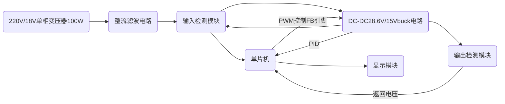

# 电赛安排 (DDL:5.30)

先把这个task management复制到自己的分支里

完成一个任务打一个勾

自己负责的模块具体细节写在自己的分支里

## 相关网站

[嘉立创教学文档](https://wiki.lceda.cn/zh-hans/contest/e-contests/basic-modules/pwr-modules/dcdc-tps5450.html)

[手撕Buck！Buck公式推导过程_buck电路输出电压公式-CSDN博客](https://blog.csdn.net/weixin_42005993/article/details/120144144)

[手撕Boost！Boost公式推导及实验验证-CSDN博客](https://blog.csdn.net/weixin_42005993/article/details/119360319)
[VSCode+Platfrom io 环境下ESP32配置TFT_eSPI和lvgl驱动1.3寸TFT屏幕_vscode platfromio-CSDN博客](https://blog.csdn.net/want_together/article/details/135407068)(注意我们用的是2.8寸)

[TFT数据手册](http://www.lcdwiki.com/zh/2.8inch_SPI_Module_ILI9341_SKU:MSP2807)

[参考的开源项目1](https://oshwhub.com/lighting-electronic-education/shu-kong-dian-yuan)

[参考的开源项目2](https://oshwhub.com/lighting-electronic-education/shu-kong-dian-yuan)

## 环境搭建

- [ ] ESP32S3N16R8+vscode+idf+platformio(初步定下arduino+platformio)
- [ ] fusion360(正版教育版免费)
- [ ] FreeRTOS+LVGI(可简化代码，毕竟基于RTOS框架)
- [ ] Autium Designer
- [ ] 嘉立创
- [ ] MSP DCDC Designer

## 学习

- [ ] 模电至少看到第五章，知道运放是个什么东西，对MOS管比较了解

## 方案

### 赛题选择

程控直流稳压电源

### 思路

### 注意点

| 注意事项                                             | 描述                 |
| ---------------------------------------------------- | -------------------- |
| 代码不要照抄 AI                                      | 避免直接复制代码     |
| 二极管整流之后电压变为 28.6V 左右而不是 18V          | 电压变化需注意       |
| 最大输出功率达到 60W 和效率达到 90% 以上是理论最大值 | 实现恒压效果即可     |
| 必须采用 FreeRTOS 框架                               | 避免多任务并行混乱   |
| PID 采取增量式                                       | 因为数据采集时间太短 |
| 纹波要求需要注意                                     | 保证电路稳定性       |

### 任务分工

| 成员     | 任务                                        |
| -------- | ------------------------------------------- |
| LCJ      | PID 和显示模块的操控                        |
| WJ       | DCDC buck 电路 + 单片机供电                 |
| WYC      | 整流电路，调纹波 +负载检测保护电路+报销整理 |
| 外形设计 | 待定                                        |

**每天在微信群沟通进度，每周写一个学习进度周报和模块进展程度报告**
**第一个DDL**：
WJ:放假前把电路图赶出来，进行打板

### 详细模块介绍

#### 变压器 + 整流滤波电路

- [x] 采用淘宝买的整流模块，测试效果
- [x] 复刻整流模块

##### 问题总结

#### 单片机供电模块

- [x] 采用LDO降压25.5->5给单片机供电（LM1117 - 3.3 线性稳压器或 XL1509 - 3.3 开关稳压器）

##### 问题总结

- 忘记预留排母引脚

#### Buck 主电路

- [x] 采用MPQ4317芯片搭建DCDC转换电路

##### 问题总结

- 没有仔细阅读datasheet中pin function 和 operation部分导致引脚使用错误和一定程度上的恐慌
- VIN,VOUT,SW引脚要做铺铜处理，用导线的话散热不行
- 如果要提高滤波效果，可以在VIN前面加上输入滤波回路EMI
- 电源转换四层PCBlayout中，采用SGVG模式，用地层隔离信号。VIN处可以打过孔在焊盘上，然后过孔开窗，提高散热效果
- 运放的供电电压必须大于输出电压
- 买器件时没有注意封装

#### 主控与显示模块

进度：

- [x] 进行UI界面设计
- 主控芯片： ESP32-N16R8（40nm 双核 CPU，内置 520KB SRAM，支持 FreeRTOS 任务调度）
- 电压采样：先加一个电压跟随器，再加电阻分压网络（100kΩ+10kΩ）将输出电压衰减 1/11，输入 ESP32 ADC1_CHANNEL6（34 号引脚，待定），精度 ±0.5%。进行计算处理后得到纹波大小，输出到屏幕中，然后进行PID调节
- 显示屏：通过SPI接口与开发板相连
- FreeRTOS系统环境搭建
- 数字电位器：SPI接口

| 任务名称        | 功能             | 优先级 | 堆栈大小 | 周期 | 通信方式            |
| --------------- | ---------------- | ------ | -------- | ---- | ------------------- |
| UI_Task         | LVGL 界面更新    | 5      | 2048     | 50ms | 队列（电压 / 电流） |
| PID_Task        | 电压闭环控制     | 4      | 1536     | 20ms | 全局变量            |
| ADC_Task        | 电压 / 电流采样  | 3      | 1024     | 10ms | 信号量              |
| Key_Task        | 按键扫描（备用） | 2      | 512      | 20ms | 事件标志组          |
| Protection_Task | 过流 / 过压监测  | 5      | 1024     | 10ms | 中断触发            |

- LVGL界面设计（仅供参考）：
主界面元素：
数值输入框：设定电压（0-15V，步进 0.1V），触控调节。
实时显示：输出电压（±0.1V）、电流（±0.01A）、功率（W）、纹波（mv）

- 状态指示灯：绿色（正常）、红色（保护触发）

- 控制按钮：启动 / 停止、校准、参数复位
- [x] PCB完成设计并下单

**校准功能**

校准按钮通过 UI_Task 的事件检测（如触控或物理按键）触发。当用户点击校准按钮时，UI_Task 通过队列向 PID_Task 发送校准指令，并在界面显示校准引导信息（如 “请连接标准电压源”）。

进入校准模式：系统暂停 PID 控制，关闭 PWM 输出，避免输出电压干扰校准过程。

禁用保护电路：暂时屏蔽过压、过流保护（如通过软件关闭 LM393 比较器中断），防止误触发。

提示用户操作：界面显示校准步骤，例如要求用户将标准电压源（如高精度电源）连接到输出端。

硬件连接：用户将标准电压源（如 10V）接入 Buck 电路输出端。

ADC 校准：

步骤：

ESP32 通过 ADC1_CHANNEL6 读取分压后的电压值（标准电压 × 1/11）。

计算误差：实际测量值与理论值（标准电压 × 1/11）的差值。

修正系数：根据误差调整分压电阻的校准系数（如将 100kΩ+10kΩ 的理论分压比 1/11 修正为实际值）。

技术实现：

利用 ESP32 的 ADC 校准驱动，通过内部或外部参考电压源（如 1.1V 基准）修正 ADC 转换误差。

若误差超过阈值（如 ±0.5%），系统提示用户检查硬件连接或更换分压电阻。

- 交互逻辑：触控输入后通过队列发送设定值至 PID 任务，避免任务竞争

- PID
[参考链接](https://www.circlemoon.top/2025/04/17/robotics/AutoPilot-learning-record/Autopilot-learning-record/)

##### 问题总结

- 引脚没有预留好足够的排针排母  

#### 输出电压电流检测电路

采样芯片推荐：INA226模块(INA226是一款由德州仪器（TI）生产的高精度电流、功率和电压监控芯片，芯片通过外部的分流电阻，将流过负载的电流转化为分流电阻上的电压降。然后，通过内部的放大器放大电压降，最终通过ADC（模数转换器）将其转化为数字信号，最后通过I2C总线发送数据到主控芯片。)

- 过流保护：当采样电流≥3.95A 时，通过硬件比较器（LM393）触发 GPIO 中断，软件关闭 PWM 输出并蜂鸣报警。
- 过压保护：输出电压 > 15.5V 时，硬件分压信号触发中断，同时软件 PID 限幅（占空比≤100%）。
- 过热保护：在 MOSFET 附近粘贴 DS18B20 温度传感器，温度 > 85℃时降额输出（占空比≤50%
- 电流采样：0.5mΩ/1% 精度采样电阻串联负载，通过 INA219 电流传感器（I2C 接口）放大信号，避免 ESP32 ADC 直接采样噪声

##### 问题总结  

#### PCBlayout

**画完原理图不要着急layout!!!**

- 分层策略：
顶层：功率器件（MOSFET、电感、二极管），铜箔加粗（≥50mil）降低导通损耗。

底层：信号走线（ADC 采样、SPI 通信），远离功率回路，采用地线隔离。

- 接地设计：
功率地与信号地单点星形连接，避免地环路干扰。

大面积覆铜增强散热，MOSFET 加装散热片（可选）。

- EMI 抑制：
PWM 走线长度 < 5cm，套磁珠抑制高频噪声。

输入输出端并联 1nF 电容到地，衰减共模干扰。
