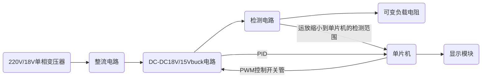

# 电赛安排

先把这个task management复制到自己的分支里

完成一个任务打一个勾
## 相关网站
[嘉立创教学文档](https://wiki.lceda.cn/zh-hans/contest/e-contests/basic-modules/pwr-modules/dcdc-tps5450.html)

## 环境搭建

- [ ] ESP32S3N16R8+vscode+idf+platformio(因为不知道使用idf还是arduino适合，所以先都安装)
- [ ] fusion360(正版教育版免费)
- [ ] FreeRTOS+LVGI(可简化代码，毕竟基于RTOS框架)
- [ ] Proteus(仿真软件)
- [ ] 嘉立创

## 学习

- [ ] 模电至少看到第五章，知道运放是个什么东西，对MOS管比较了解

## 方案

### 赛题选择

程控直流稳压电源

### 思路

### 注意点

- 代码不要照抄AI
- 最大输出功率达到60W和效率达到90%以上是理论最大值，而实际上实现恒压效果就可以了
- PID可以考虑Lambda参数整定
- 纹波要求需要注意

### 任务分工

- LCJ负责PID和显示模块的操控
- WJ负责DCDCbuck电路+检测电路+负载电路
- WYC负责整流电路，调纹波
- 外形设计，待定
**每天在微信群沟通进度，每周写一个学习进度周报和模块进展程度报告**
