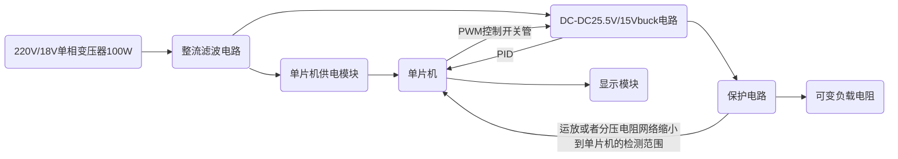

# 电赛安排

先把这个task management复制到自己的分支里

完成一个任务打一个勾

## 相关网站

[嘉立创教学文档](https://wiki.lceda.cn/zh-hans/contest/e-contests/basic-modules/pwr-modules/dcdc-tps5450.html)

## 环境搭建

- [ ] ESP32S3N16R8+vscode+idf+platformio(初步定下arduino+platformio)
- [ ] fusion360(正版教育版免费)
- [ ] FreeRTOS+LVGI(可简化代码，毕竟基于RTOS框架)
- [ ] Proteus(仿真软件)
- [ ] 嘉立创

## 学习

- [ ] 模电至少看到第五章，知道运放是个什么东西，对MOS管比较了解

## 方案

### 赛题选择

程控直流稳压电源

### 思路

### 注意点

| 注意事项 | 描述 |
|-----------|------|
| 代码不要照抄 AI | 避免直接复制代码 |
| 二极管整流之后电压变为 25.5V 左右而不是 18V | 电压变化需注意 |
| 最大输出功率达到 60W 和效率达到 90% 以上是理论最大值 | 实现恒压效果即可 |
| 必须采用 FreeRTOS 框架 | 避免多任务并行混乱 |
| PID 可以考虑 Lambda 参数整定 | 优化控制 |
| 纹波要求需要注意 | 保证电路稳定性 |

### 任务分工

| 成员 | 任务 |
|------|------|
| LCJ | PID 和显示模块的操控 |
| WJ | DCDC buck 电路 + 单片机供电 + 保护电路 + 负载电路 |
| WYC | 整流电路，调纹波 + 报销整理 |
| 外形设计 | 待定 |

**每天在微信群沟通进度，每周写一个学习进度周报和模块进展程度报告**

### 详细模块介绍

#### 变压器 + 整流滤波电路

| 步骤 | 描述 |
|------|------|
| 变压器输入两条线需要连接插座 | 确保电源连接 |
| 变压器输出端正极和负极分别接双向 TVS 管地两头 (SMBJ24CA) | 防止浪涌电压 |
| 整流桥采用全桥整流，4 颗 1N5408 | 输出地直流电压约为 25.5V |
| 一级滤波 | 2 颗 4700μF/35V 电解电容并联，配合 10μH 功率电感组成 π 型滤波 |
| 高频滤波 | 2 颗 100μF/25V 钽电容 + 2 颗 0.1μF 陶瓷电容，目标纹波 ≤ 15mV |

#### 单片机供电模块

- [ ] 采用LDO降压25.5->3给单片机供电（LM1117 - 3.3 线性稳压器或 XL1509 - 3.3 开关稳压器）
- [ ] 直接内置锂电池供电

#### Buck 主电路

| 元件 | 选型 | 功能说明 |
|------|------|----------|
| 主控开关管 | IRF3205 (110A/55V) | N 沟道 MOSFET，低导通电阻（8mΩ），支持高频开关（100kHz） |
| 续流二极管 | SS34 (3A/40V 肖特基) | 快速恢复，降低反向恢复损耗 |
| 储能电感 | 47μH/5A 功率电感 | 饱和电流 ≥ 5A，DCR ≤ 50mΩ |
| 输出电容 | 2 颗 1000μF/25V 电解 + 2 颗 10μF 钽电容 | 组合滤波，提升瞬态响应 |
| PWM 驱动 | ESP32 内置 LED 控制器 | 10 位分辨率，20kHz 开关频率（降低 EMI） |

- 电流采样：0.01Ω/1% 精度采样电阻串联负载，通过 INA219 电流传感器（I2C 接口）放大信号，避免 ESP32 ADC 直接采样噪声

#### 主控与显示模块

- 主控芯片： ESP32-N16R8（40nm 双核 CPU，内置 520KB SRAM，支持 FreeRTOS 任务调度）
- 电压采样：电阻分压网络（100kΩ+10kΩ）将输出电压衰减 1/11，输入 ESP32 ADC1_CHANNEL6（34 号引脚，待定），精度 ±0.5%。
- 显示屏：通过SPI接口与开发板相连
- FreeRTOS系统环境搭建

| 任务名称         | 功能               | 优先级 | 堆栈大小 | 周期   | 通信方式               |
|------------------|--------------------|--------|----------|--------|------------------------|
| UI_Task          | LVGL 界面更新      | 5      | 2048     | 50ms   | 队列（电压 / 电流）    |
| PID_Task         | 电压闭环控制       | 4      | 1536     | 20ms   | 全局变量               |
| ADC_Task         | 电压 / 电流采样    | 3      | 1024     | 10ms   | 信号量                 |
| Key_Task         | 按键扫描（备用）   | 2      | 512      | 20ms   | 事件标志组             |
| Protection_Task  | 过流 / 过压监测    | 5      | 1024     | 10ms   | 中断触发               |

- LVGL界面设计（仅供参考）：
主界面元素：
数值输入框：设定电压（0-15V，步进 0.1V），触控调节。
实时显示：输出电压（±0.1V）、电流（±0.01A）、功率（W）

- 状态指示灯：绿色（正常）、红色（保护触发）

- 控制按钮：启动 / 停止、校准、参数复位

**校准功能**

校准按钮通过 UI_Task 的事件检测（如触控或物理按键）触发。当用户点击校准按钮时，UI_Task 通过队列向 PID_Task 发送校准指令，并在界面显示校准引导信息（如 “请连接标准电压源”）。

进入校准模式：系统暂停 PID 控制，关闭 PWM 输出，避免输出电压干扰校准过程。

禁用保护电路：暂时屏蔽过压、过流保护（如通过软件关闭 LM393 比较器中断），防止误触发。

提示用户操作：界面显示校准步骤，例如要求用户将标准电压源（如高精度电源）连接到输出端。

硬件连接：用户将标准电压源（如 10V）接入 Buck 电路输出端。

ADC 校准：

步骤：

ESP32 通过 ADC1_CHANNEL6 读取分压后的电压值（标准电压 × 1/11）。

计算误差：实际测量值与理论值（标准电压 × 1/11）的差值。

修正系数：根据误差调整分压电阻的校准系数（如将 100kΩ+10kΩ 的理论分压比 1/11 修正为实际值）。

技术实现：

利用 ESP32 的 ADC 校准驱动，通过内部或外部参考电压源（如 1.1V 基准）修正 ADC 转换误差。

若误差超过阈值（如 ±0.5%），系统提示用户检查硬件连接或更换分压电阻。

- 交互逻辑：触控输入后通过队列发送设定值至 PID 任务，避免任务竞争

- PID
[参考链接](https://www.circlemoon.top/2025/04/17/robotics/AutoPilot-learning-record/Autopilot-learning-record/)

#### 保护电路

- 过流保护：当采样电流≥4.2A 时，通过硬件比较器（LM393）触发 GPIO 中断，软件关闭 PWM 输出并蜂鸣报警。
- 过压保护：输出电压 > 15.5V 时，硬件分压信号触发中断，同时软件 PID 限幅（占空比≤100%）。
- 过热保护：在 MOSFET 附近粘贴 DS18B20 温度传感器，温度 > 85℃时降额输出（占空比≤50%

#### PCBlayout

**画完原理图不要着急layout!!!**

- 分层策略：
顶层：功率器件（MOSFET、电感、二极管），铜箔加粗（≥50mil）降低导通损耗。

底层：信号走线（ADC 采样、SPI 通信），远离功率回路，采用地线隔离。

- 接地设计：
功率地与信号地单点星形连接，避免地环路干扰。

大面积覆铜增强散热，MOSFET 加装散热片（可选）。

- EMI 抑制：
PWM 走线长度 < 5cm，套磁珠抑制高频噪声。

输入输出端并联 1nF 电容到地，衰减共模干扰。
