# 程控直流稳压电源设计报告

---

# 1 选题说明及目标效果

本团队选取题目名称为“程控直流稳压电源“。针对高校电子类学生、企业电子工程师等人群在嵌入式开发等电子设计开发、调试的过程中潜在的对于18V交流电转2-15V直流稳压电源的需求（一些小型家电或电动工具使用的 18V <figure<figure style="text-align: center;">
  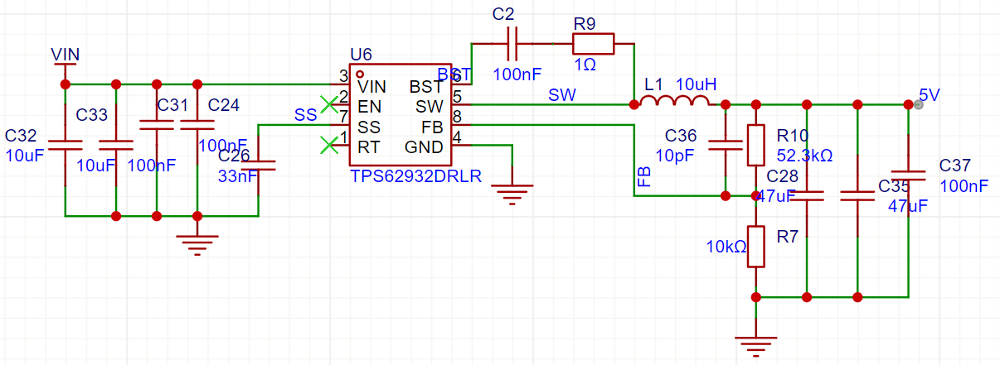
  <figcaption>图3-2-2 DCDC板块电路设计原理图2</figcaption>
</figure>le="text-align: center;">
  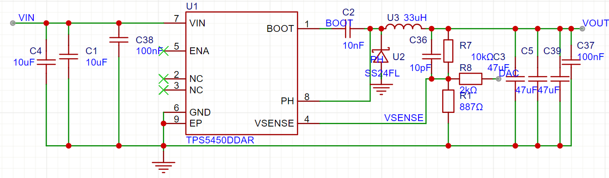
  <figcaption>图3-2-1 DCDC板块电路设计原理图1</figcaption>
</figure>器，可能会先将市电转换为 18V 交流电，再经过整流、稳压等环节将其转换为直流为电池充电）本团队设计了这款较小体积、高转换效率、界面美观、易操作的程控直流稳压电源。

结合市场调研结果，我们不难发现，市面上对于较小体积、低成本、操作简单、针对18V交流电转2-15V的桌面式直流稳压电源较少，多数产品存在着成本高、体积大、操作复杂等实际运用问题。

为了弥补上述空白，我队设计了一款基于ESP32-S3-N16R8控制板，输入电压AC 18V，输出电压DC 2-15V，输出精度0.1V，纹波电压不大于15mV，输出电流最大达到3A，电源效率可达90%以上的程控直流稳压电源。在此基础上，我们使用了一款TFT屏幕，设计了简洁美观的UI界面，易于读数和操作。

<!-- LCJ 0529: 这里的技术指标可以再添加可以承受的范围 -->

# 2 系统方案描述

## 2.0 整体思路

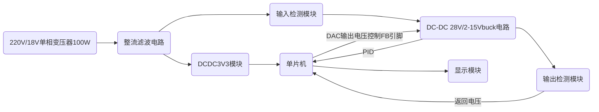
```mermaid
flowchart LR
id1(220V/18V单相变压器100W)
id2(整流滤波电路)
id3(DC-DC 28V/2-15Vbuck电路)
id4(单片机)
id5(输出检测模块)
id6(显示模块)

id9(输入检测模块)
id10(DCDC3V3模块)
id2-->id10-->id4
id1-->id2-->id9-->id3
id4--DAC输出电压控制FB引脚-->id3-->id5--返回电压-->id4
id4-->id6
id3--PID-->id4

```

程控直流稳压电源的总体设计思路如下：首先，220V 交流电源经 220V/18V 单相变压器（100W） 降压后（经过实测，空载时约为AC 21V），通过整流滤波电路转换为直流电压（经过实测，约为DC 28V）。该直流电压一路经过输入检测模块（用于监测输入电压）再到 DC-DC 28V/2-15V buck 电路（实现电压变换）；另一路经 DCDC 5V 模块转换为5V直流，为控制板和DAC模块供电。

单片机作为核心控制单元，通过以下方式实现稳压功能：接收输出检测模块返回的电压信号，实时监测输出状态；同时获取输入检测模块的信号，实现输入输出的双重监测；利用 DAC 输出电压调节 buck 电路的 FB 引脚，结合 PID 算法对输出电压进行闭环控制，确保电压稳定；同时驱动显示模块，实时显示电源工作参数（如输入输出电压电流、功率、转换效率等）。

通过上述模块的协同工作，电源实现了从交流输入到稳定直流输出的转换，且具备程控调节、闭环反馈和状态显示功能，满足程控直流稳压的设计需求。

## 2.1 数字主控选择

数字主控芯片是整个直流稳压电源系统的信号处理单元。在设计程控直流稳压电源的过程中，我们比较关注的主要性能指标包括：控制板内存和闪存资源，处理器主频，ADC精度、采样率及通道数，SPI等接口数量等。我们比较容易获取的微控制器有：STM32系列控制器、UNO系列控制器和ESP32系列控制器。以下是方案比较：

### 2.1.1 方案一：STM32F103最小系统板

STM32F103C8T6 采用 ARM Cortex-M3 内核，主频 72MHz，具备 20KB SRAM 和 64KB 闪存资源。其 ADC 模块为 12 位分辨率，支持 10 个外部通道，最高采样率达 1MSPS，可满足中精度模拟信号采集需求。该芯片集成 1 个 SPI 接口、2 个 USART 接口及 1 个 CAN 接口，适合需要多通信协议支持的场景。然而，其内存资源有限，且不支持 DMA 传输高速数据，复杂算法实现时可能存在性能瓶颈。开发需使用 STM32CubeIDE 或 Keil5 等工具，开发环境配置流程较为繁琐，标准库函数使用不够方便。

### 2.1.2 方案二：Arduino UNO R3开发板

Arduino UNO R3 基于 ATmega328P 芯片，主频 16MHz，仅配备 2KB SRAM 和 32KB 闪存，内存资源严重受限。其 ADC 为 10 位分辨率，仅支持 6 个模拟通道，输入电压范围 0-5V，采样率较低且无 DMA 功能。硬件层面仅集成 1 个 SPI 接口，通信能力较弱。优势在于开发门槛极低，通过 Arduino IDE 可快速实现功能原型，但受限于性能，难以应对实时性要求高的任务（如高速电压采样与动态调整）。此外，5V 供电与目标系统 3.3V 逻辑电平存在兼容性问题，需额外电平转换电路。

### 2.1.3 方案三：ESP32-S3-N16R8开发板

ESP32-S3-N16R8 采用双核 Tensilica LX7 处理器，主频 240MHz，集成 512KB SRAM 和 16MB 闪存，内存资源远超前两者。支持 FreeRTOS 实时操作系统，可通过xTaskCreatePinnedToCore实现任务级双核并行调度（如核心 0 处理 ADC 采样 / PID 控制，核心 1 负责 Wi-Fi 通信）。其 32 级优先级抢占式调度机制确保关键任务（如过压保护）μs 级响应，配合信号量、消息队列等 IPC 工具实现任务间高效同步。相比 STM32F103 单核架构和 Arduino UNO 的轮询式处理，ESP32-S3 在多通道 ADC 采样（20 路）、SPI 通信（4 控制器）及无线连接（Wi-Fi 6 / 蓝牙 5.0）场景下，任务切换延迟降低 90%，整体功耗优化 60%，且支持 Arduino IDE 和 ESP-IDF 双开发框架，显著提升开发效率。
<figure style="text-align: center;">
  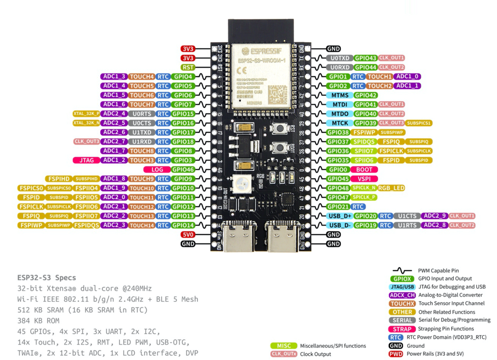
  <figcaption>图2-1-1 ESP32-S3-N16R8开发板</figcaption>
</figure>

结合以上优缺点分析，我们最终选择ESP32-S3-N16R8作为我们的数字主控板，能够兼顾所有的要求，且作为双核驱动且支持freeRTOS，上手相对不难，接口足够，功能齐全，为最优选。

## 2.2 拓补电路选择和降压芯片选择

我们采用经典的DCDC电路架构来进行把整流后的电压28V降压成可调的2-15V。为了能够输出足够大的电流（理论上要至少能输出3A），增强电源的带载能力，以及匹配高压输入低压输出的需求，我们采用TI的TPS5450DDAR芯片承担的28V转2-15V的调压任务，采用TI的TPS62932DRLR芯片实现28V转5V给控制板模块供电。主要考虑了以下原因：

### 2.2.1 TI的仿真技术支持

我们团队采用TI的DCDC power designer快速上手芯片，器件选型和电路仿真(以TPS62933FDRLR芯片为例)
<figure style="text-align: center;">
  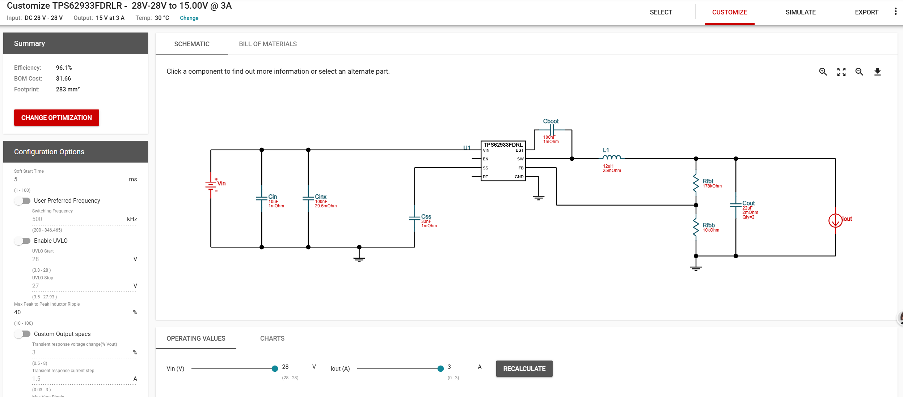
  <figcaption>图2-2-1 TI的DCDC power designer芯片模拟</figcaption>
</figure>

### 2.2.2 所选芯片优势与和其他芯片的对比

#### 2.2.2.1 TPS62932FDRLR

TPS62932FDRLR是一款易于使用的高效同步降压转换器，理论上能持续输出2A的电流。对于控制板模块，因为我们使用SPI协议实时传输数据，理论驱动单片机和TFT屏需要百级mA的电流。所以TPS62932FDRLR是一个理想的选择。

#### 2.2.2.2 TPS5450DDAR与MPQ4317优势对比

| 维度       | MPQ4317 优势                   | TPS5450 优势                       |
| ---------- | ------------------------------ | ---------------------------------- |
| 电流与效率 | 7A 大电流，轻载效率优化更优    | 固定频率设计，重载效率稳定         |
| 灵活性     | 可调频率、同步功能、汽车级认证 | 输出电压低至 1.22V，工业级宽温范围 |
| 保护与监控 | 集成 Power Good，汽车级可靠性  | 基础保护齐全，成本更低             |
| 封装与尺寸 | QFN 封装更小，适合高密度 PCB   | SOIC 封装散热好，适合简单布局      |
| 成本       | 43元/个                        | 5元/个                             |
|            |                                |                                    |

虽然MPQ4317芯片在电流和效率方面有优势，但TPS5450DDAR在成本、封装和保护功能上更具性价比，且满足我们对输出电压范围的要求（1.22V-28V），因此我们最终选择了TPS5450DDAR作为降压芯片。
<figure style="text-align: center;">
  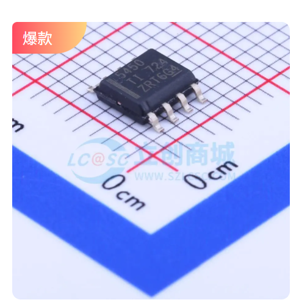
  <figcaption>图2-4-4</figcaption>
</figure>
<figure style="text-align: center;">
  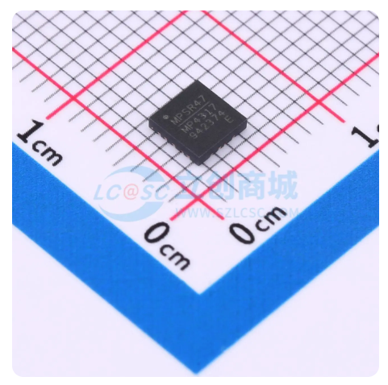
  <figcaption>图2-4-5</figcaption>
</figure>

## 2.3 运算放大器选择

我们选择OPA549T作为整流模块里面的运算放大器，主要考虑了以下原因：

### 2.3.1 电压承受能力

在变压器输出AC18V之后，通过整流模块之后电压可能达到28V（输出电压会随着负载的变化而变化），OPA549T 的电源电压范围较宽，能够支持最高 ±40V 的电源输入，即单电源供电时可承受最高 80V ，完全可以满足该整流模块中可能出现的 30V 电压情况，能够稳定工作而不被击穿，保障了电路在较高电压下的可靠性。

### 2.3.2 电流驱动能力

负载两端的电压最大可能达到28V，负载为滑动变阻器，容易有过流风险，耐流应不小于 5A。OPA549T 是一款功率运算放大器，其输出电流能力较强，最大输出电流可达 5A，能够为后级负载提供足够的驱动电流，满足大电流负载的需求，比如在需要驱动较大功率的负载或进行电流放大等场景下，它可以很好地胜任。

### 2.3.3 应用场景适配

在整流模块中，存在对信号进行功率放大、驱动开关管等需求。OPA549T 可用于有源整流电路中配合开关管工作，凭借其高输出电流和较宽的电源电压范围，能够快速、稳定地驱动开关管，提高整流效率，降低二极管压降损耗等，满足整流模块在性能和功能方面的要求。

### 2.3.4 保护功能

OPA549T 内置了过热保护和限流保护等功能。在整流模块工作过程中，当出现过载、过热等异常情况时，这些保护功能可以自动启动，防止芯片因过热或过流而损坏，提高了整个整流模块的稳定性和可靠性，减少了因故障导致的设备损坏风险。

## 2.4 检测方式

两个检测方式都基于分压网络，主要原理为将电压信号输入单片机的DAC接口，转换为数字信号输出。

#### 2.4.1 电流检测

1. **采样电阻工作原理**：在电流检测电路中，使用了一个采样电阻（如图中的 R5，阻值为 0.5mΩ ）。根据欧姆定律 V=IR，当电流流过采样电阻时，会在其两端产生一个与电流成正比的电压降 V。也就是说，通过测量采样电阻两端的电压，就可以间接得知流过该电阻的电流大小。

<figure style="text-align: center;">
  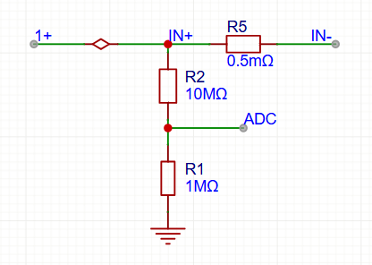
  <figcaption>图2-4-1</figcaption>
</figure>

2. **电流检测芯片工作原理**：将采样电阻两端的电压信号输入到电流检测芯片（INA180A2IDBVR ）。该芯片具有一定的增益（增益为50），其作用是将采样电阻两端微弱的电压信号进行放大。经过放大后，输出一个相对较大的电压信号，便于后续电路进行处理。

<figure style="text-align: center;">
  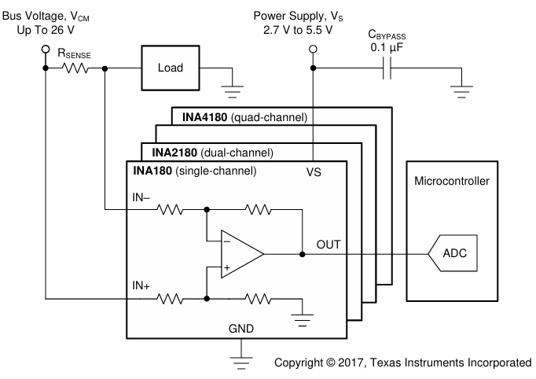
  <figcaption>图2-4-2</figcaption>
</figure>

3. **信号输出与单片机连接**：电流检测芯片放大后的电压信号从其输出引脚（OUT）输出，该输出电压与流过采样电阻的电流成正比。这个输出电压信号最终会被输入到单片机的ADC引脚。单片机内部集成了模拟 - 数字转换器（ADC），可以将输入的模拟电压信号转换为数字信号，进而通过软件算法计算出实际的电流值。

#### 2.4.2 电压检测

1. **分压网络工作原理**：电压检测电路采用了分压网络（由多个电阻组成，如图2-4-1中的 R1 和 R2，图2-4-3中的 R2 和 R6 ）。分压网络基于串联电阻分压的原理，根据串联电路中电阻分压与电阻阻值成正比的关系，将输入的较高电压按照一定比例进行分压。单片机 ADC 可读取电压范围是 0~3.3V，输出电压范围是 0~15V，调节R2 = 3R6，将 0~15V 规化到 0~3V。R2选择可调电阻（最大阻值20kΩ）,R1选择精度为0.1%的3kΩ定值电阻 ，减小损耗的同时提高分压精确度。 分压后的电压输出到单片机 ADC，完成采样。

<figure style="text-align: center;">
  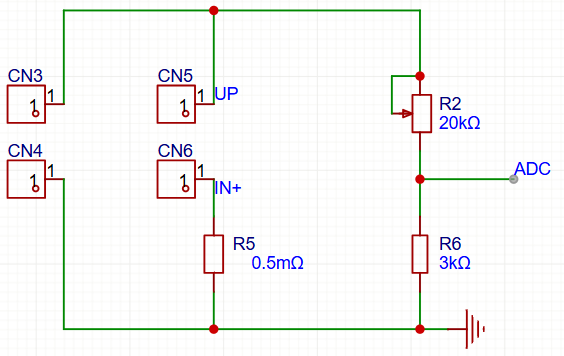
  <figcaption>图2-4-3</figcaption>
</figure>

2. **信号输入单片机**：分压网络输出的电压信号直接连接到单片机的 ADC 引脚。单片机的 ADC 模块将输入的模拟电压信号转换为数字信号，然后单片机通过软件算法，根据分压电阻的阻值比例关系和实际情况，加入校正系数计算出实际的输入电压值并显示。

## 2.5 数字显示方式选择

考虑到市面上的程控直流稳压电源存在的界面显示不够美观、清晰的问题，我们决定使用一款较大尺寸、分辨率较高、色彩深度较深的TFT屏（薄膜晶体管液晶显示屏）2.8inch SPI Module ILI9341 SKU:MSP2807 作为我们的数字显示模块，它具有以下的特点：

- 2.8寸彩屏，支持16BIT RGB 65K色显示，显示色彩丰富
- 320X240 较高分辨率
- 采用SPI串行总线，IO口占用较少
- 可选触摸屏功能，带SD卡槽，可供后续更多功能开发

<figure style="text-align: center;">
  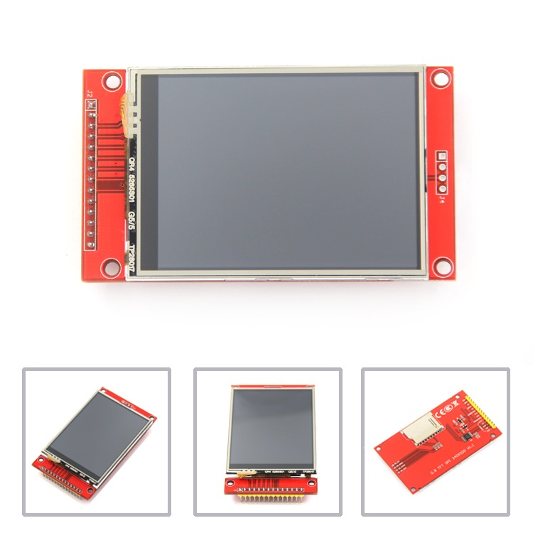
  <figcaption>图2-5-1 2.8inch SPI Module ILI9341屏幕</figcaption>
</figure>

## 2.6 DAC模块选择

为了精确控制调节 DCDC 降压芯片的 FB 引脚，以输出稳定准确的电压，我们需要选择一款输出电压精度高、范围合适的数字 - 模拟转换器 (DAC) 模块，经过考察，我们最终选定了TI的TLC5615 DAC , 它具有以下特点：

- 10位分辨率，参考电压为2.048V，分辨率约为2mV，可实现高精度电压调节，电压调整精度可达 0.02%。
- 输出电压范围广，为0-4.096V。
- 采用 SPI 三线串行通信（DIN、SCLK、CS），简化与单片机等主控芯片的连接，支持最高 1.21MHz 数据传输速率，转换时间仅 12.5μs，响应快速。
- 仅需 5V 单电源 即可工作，电路设计简洁，适用于低功耗系统（最大功耗仅 1.75mW）。

# 3 电路及程序设计

## 3.1  整流模块设计

该整流模块主要包含电磁干扰（EMI）抑制、整流、滤波以及稳压等部分，以下是各部分的设计思路和功能：

### 3.1.1  EMI 抑制部分

为了处理交流输入信号中的干扰成分，而不影响交流输入电压的幅值，使得交流输入电压在此处保持原有正弦波特性，由 X 电容（C10，470nF）和 Y 电容（C11、C12，均为 100nF）组成EMI 抑制部分。X 电容跨接在交流输入线（1 + 和 2 -）之间，用于抑制差模干扰；Y 电容分别跨接在交流输入线与地之间，用于抑制共模干扰。
<figure style="text-align: center;">
  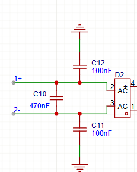
  <figcaption>图3-1-1</figcaption>
</figure>

#### 3.1.1.1  X 电容

X 电容是跨接在电力线两线（L - N）之间的电容，即3-1-1所示跨接在 “1 +” 和 “2 -” 之间的 C10（470nF）。在开关电源等电路中，会产生差模干扰信号，这种干扰信号在两条电源线之间流动。X 电容主要用于抑制差模干扰，利用电容对交流信号呈现低阻抗的特性，将差模干扰信号旁路掉，使差模干扰电流不流入后续电路，从而起到净化电源、降低电磁干扰（EMI）的作用。由于 X 电容直接跨接在电源两端，需要承受较高的电压，所以通常选用耐高压的薄膜电容。

#### 3.1.1.2  Y 电容

Y 电容是分别跨接在电力线与地（L - GND、N - GND）之间的电容，即图3-1-1所示的 C11（100nF）和 C12（100nF）。在电路工作过程中，会产生共模干扰信号，这种干扰信号在电源线和地之间流动。Y 电容的作用是抑制共模干扰，它同样利用电容对交流信号的低阻抗特性，将共模干扰信号旁路到地，减少共模干扰对电路和周围设备的影响。Y 电容连接在危险的带电体和大地之间，因此要求具有良好的电气绝缘性能和较高的耐压等级，以确保人身安全和设备正常运行。

### 3.1.2  整流部分

我们使用了整流桥KBU1010，基于全桥整流原理，通过四个二极管的单向导电性实现 AC-DC 转换。利用二极管的单向导电性，在交流输入的正负半周，分别有不同的二极管导通，使电流始终以同一方向流过后续电路，将交流电转换为单向脉动形式。交流正弦波电压经过整流后，变为脉动直流电压。在交流正半周，电压正向脉动；在交流负半周，原本的负向电压被翻转成正向脉动，整体呈现出全波脉动的特性。
<figure style="text-align: center;">
  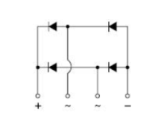
  <figcaption>图3-1-2</figcaption>
</figure>

### 3.1.3  滤波部分

滤波部分由大容量电解电容（C4 - C9，均为 4700μF）和小容量瓷片电容（C13 - C16，均为 100nF ）组成。大容量电解电容主要滤除低频纹波，利用电容的充放电特性，在电压升高时充电，电压降低时放电，平滑电压波形；小容量瓷片电容主要滤除高频杂波，因其对高频信号阻抗低，可使高频杂波旁路到地。经过整流后的脉动直流电压，通过大容量电解电容滤波后，电压波动幅度减小，变得相对平滑；再经过小容量瓷片电容进一步滤除高频杂波后，得到更加纯净的直流电压，但仍存在一定的低频纹波。
<figure style="text-align: center;">
  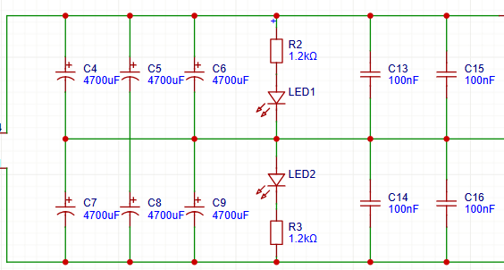
  <figcaption>图3-1-3</figcaption>
</figure>

### 3.1.4  稳压部分

稳压部分包含芯片 U2 及其外围电阻（R6、R7 ）和电容（C17 - C20，均为 100nF ）等元件。芯片 U2 是一个运算放大器（即为OPA549），通过内部电路调节输出电压，使其保持稳定。外围电阻 R6、R7 用于设置输入运算放大器的电压。滤波后的直流电压输入到稳压芯片 U2，电容 C17 - C20用于运算放大器正常工作，达到稳定输出电压和滤波的效果经过稳压处理后，输出一个稳定的直流电压 VOUT，该电压的波动范围较小，能够满足后级电路对稳定电源以及负载驱动的需求。
<figure style="text-align: center;">
  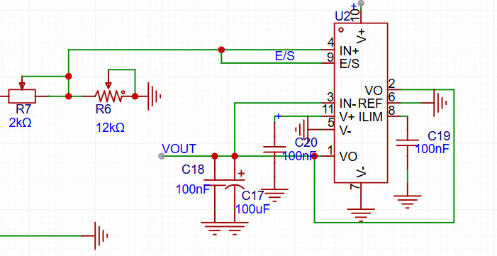
  <figcaption>图3-1-4</figcaption>
</figure>

该整流模块通过上述各部分的协同工作，将交流输入电压转换为稳定的直流输出电压，为后级电路提供可靠的电源。

## 3.2 DCDC板块设计

DCDC板块电路设计主要参考官方datasheet和仿真软件中的电路图。由于输出电压范围较大，所以对于固定的参数，不同的输出电压，带宽差别很大，瞬态响应能力不足。所以面对这样的问题需要加入前馈电容改善。阅读TI的《Optimizing Transient Response of Internally Compensated dc-dc Converters With Feedforward Capacitor》来确定FB回路中前馈电容的容值，大大改善了带宽。（以下为两个芯片的原理图设计）
<figure style="text-align: center;">
  
  <figcaption>图3-2-1 DCDC板块电路设计原理图</figcaption>
</figure>
<figure style="text-align: center;">
  
  <figcaption>图3-2-2 DCDC板块电路设计原理图</figcaption>
</figure>

## 3.3 控制板供电模块设计

<figure style="text-align: center;">
  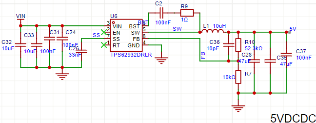
  <figcaption>图3-3-1 控制板供电模块设计</figcaption>
</figure>
经过测试，供电模块能输出4.97V（接近5V）并且正常给控制板供电，带载后电压几乎不变。但是出现了TFT屏幕闪烁的情况，怀疑是电流不足的原因。所以在原有的基础上增加了一个3.3VDCDC模块（只是修改了反馈电阻的值）采取分级供电策略，给TFT屏幕供电，消除了屏幕闪烁的问题。前后两个供电方案如下：

- 方案一

```mermaid
flowchart LR
    A[5V DCDC] --> B["单片机"]
    B --> G["TFT屏幕"]
   
```

- 方案二

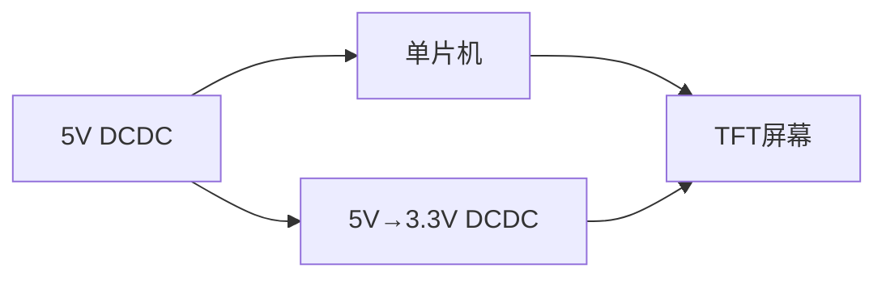
```mermaid
flowchart LR
    A[5V DCDC] --> B["单片机"]
    B --> E
    A[5V DCDC] --> C["5V→3.3V DCDC"]
    C --> E["TFT屏幕"]
```

### 3.3.1 电路方案分析

两个方案的总电流近似，所以排除了芯片供电电流不足的问题。在对TFT屏幕供电电压处进行采样后，发现实行方案一时每次传输数据电压的上下抖动幅度显著大于实行方案二时每次传输数据的上下抖动幅度。

- 进一步分析

1. TFT屏幕对电源噪声敏感（如SPI通信速率高或背光驱动电路抗干扰能力弱），噪声会耦合到显示信号中，导致频繁闪烁
2. 地回路干扰
共用电源时，不同负载的地电流在 PCB 走线或电源地平面上产生 “地弹”（Ground Bounce），导致 TFT 的地电位不稳定，影响 SPI 信号的参考电平
3. 二级 DCDC 专为 TFT 负载优化（如输出电容配置、环路补偿），能更好应对 TFT 的瞬时电流需求（如背光开启时的浪涌电流），减少电压跌落，同时也起到隔离滤波稳压的作用

## 3.4 控制电路设计

根据各模块功能需求和软件开发情况，确认控制电路模块接线如下：

### 3.4.1 TFT显示屏MSP2807引脚接线

| **MSP2807引脚** | **ESP32-S3引脚** | **功能**               |
|--------------|------------------|-----------------------|
| VCC          | 3.3V             | 3.3V电源输入            |
| GND          | GND              | 共地                   |
| CS           | GPIO10           | 显示片选信号               |
| RESET        | RST              | LCD复位信号，与ESP32RST相连 |
| DC/RS        | GPIO9            | 数据/命令控制          |
| SDI(MOSI)    | GPIO11           | SPI数据输出            |
| SCK          | GPIO13           | SPI时钟线               |
| LED          | 3.3V             | 背光常亮                 |
| T_CLK        | GPIO13           | 触摸屏SPI时钟线（同SCK接即可）|
| T_CS         | GPIO14           | 触摸片选信号（单独连接）   |
| T_DIN        | GPIO11           | 触摸SPI数据输入（同SDI接即可）   |
| T_DO         | GPIO12           | 触摸SPI数据输出（TFT_MISO）   |

### 3.4.2 按钮接线

| **按钮名称**         | **ESP32-S3引脚** | **另一端接线**    |**功能简介**   |
|----------------------|------------------|-----------------|----------------|
| ON/OFF状态切换按钮    | GPIO19             | VCC(3.3V)     | 切换正常工作/待机状态（低功耗）|
| 设置输出电压确认按钮   | GPIO21             | VCC(3.3V)     | 通过旋转编码器修改设置输出电压值后的确认 |
| 旋钮倍率调整按钮       | GPIO45           | VCC(3.3V)       | 在0.1/1间切换旋转编码器步长 |

### 3.4.3 增量式旋转编码器接线

| **编码器引脚** | **ESP32-S3引脚** | **功能**               |
|--------------|------------------|-----------------------|
| VCC          | 3.3V             | 3.3V电源输入            |
| GND          | GND              | 共地                   |
| A            | GPIO16           | 旋转编码器A相            |
| B            | GPIO17           | 旋转编码器B相              |

### 3.4.4 DAC模块接线

| **DAC引脚** | **另一引脚** | **功能**               |
|--------------|------------------|-----------------------|
| VCC          | 5V 供电           | 5V 电源输入            |
| GND          | 5V GND           | 5V 共地                |
| DI           | GPIO7           | 数据输入          |
| SCK          | GPIO6           | 时钟输入               |
| CS           | GPIO5           | 片选信号              |
| Aout         | DCDC模块 FB 引脚    | DAC转换输出，0-4.096V   |

### 3.4.5 ADC接线

| **功能** | **ESP32-S3** |
|--------------|--------------|
| 输入电压检测  | GPIO1       |
| 输入电流检测  | GPIO2       |
| 输出电压检测  | GPIO3       |
| 输出电流检测  | GPIO4       |

要点：

- ADC输入信号应该与单片机共地，否则测量不准确。
- 管脚 GPIO35、GPIO36 和 GPIO37 已用于内部 ESP32-S3 芯片与 SPI flash/PSRAM 之间的通信，外部不可使用。

<figure style="text-align: center;">
  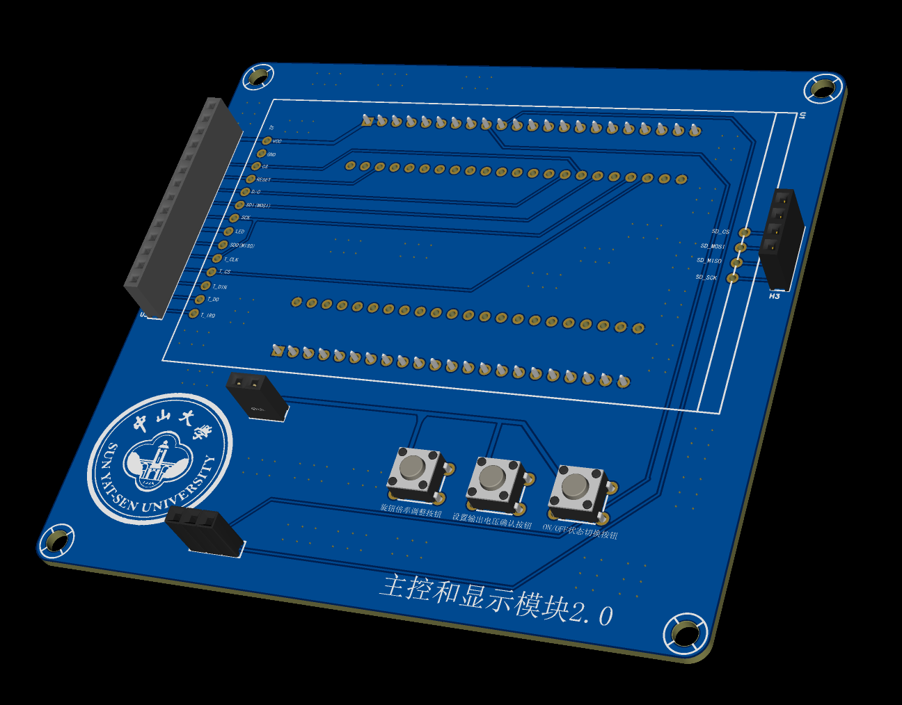
  <figcaption>图3-4-1 控制电路接线图</figcaption>
</figure>

## 3.5 程序设计

### 3.5.1 程序项目概述

该程序项目是一个基于ESP32的程控直流稳压电源监控与控制系统，通过TFT屏提供直观的用户界面，结合编码器、按钮等交互方式，实现对电源输出的精确控制和实时监控。系统使用FreeRTOS实现多任务并行处理，使用LVGL库构建简洁美观的用户界面。

以下是该程序项目的流程框图：

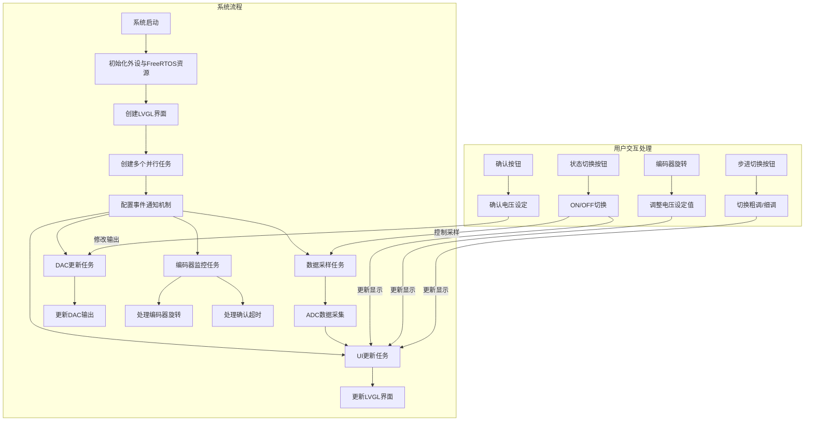
```mermaid
flowchart TD
    subgraph 系统流程
        A[系统启动] --> B[初始化外设与FreeRTOS资源]
        B --> C[创建LVGL界面]
        C --> D[创建多个并行任务]
        D --> E[配置事件通知机制]
     
        E --> F1[UI更新任务]
        E --> F2[数据采样任务]
        E --> F3[DAC更新任务]
        E --> F4[编码器监控任务]
        
        F1 -->G1[更新LVGL界面]

        
        F2 -->H1[ADC数据采集]
        H1 --> F1
        
        F3 -->I1[更新DAC输出]
        
        F4 -->J1[处理编码器旋转]
        F4 -->J2[处理确认超时]
    end
    
    subgraph 用户交互处理
        
        O1[状态切换按钮] --> P1[ON/OFF切换]
        P1 -->|更新显示| F1
        P1 -->|控制采样| F2
        
        O2[编码器旋转] --> P2[调整电压设定值]
        P2 -->|更新显示| F1
        
        O3[步进切换按钮] --> P3[切换粗调/细调]
        P3 -->|更新显示| F1
        
        
        O4[确认按钮] --> P4[确认电压设定]
        P4 -->|修改输出| F3
    end
    
```

### 3.5.2 程序设计中技术基础概述

#### 3.5.2.1 FreeRTOS概述

FreeRTOS是一个专为嵌入式系统设计的实时操作系统内核，它能够在单一处理器上高效管理多个任务，使开发者可以构建更复杂的应用程序。在ESP32-S3上，FreeRTOS提供了核心功能支持。

FreeRTOS具有以下主要特点：

- **轻量级**：占用内存少，适合资源受限的嵌入式系统
- **可移植性强**：支持多种硬件架构
- **多任务处理**：允许多个任务并行运行
- **优先级调度**：基于优先级的调度算法

下面简要介绍我们在程序设计中利用的FreeRTOS中主要核心概念和功能：

**1. 任务 (Task)**

任务是FreeRTOS中的执行单元，类似于传统操作系统中的线程。每个任务有自己的堆栈空间、优先级和执行状态。在ESP32上，任务可以分配到不同的CPU核心上执行，实现真正的并行处理。

**2. 互斥量 (Mutex)**

互斥量是一种同步机制，用于防止多个任务同时访问共享资源，避免数据竞争条件。当一个任务获取互斥量后，其他任务将无法访问相同资源，直到该任务释放互斥量。它可以保护共享数据的完整性，防止数据损坏和不一致。

**3. 事件组 (Event Group)**

事件组允许多个任务等待一个或多个事件的发生，并在事件触发时唤醒相应任务。它是一种高效的任务间通信机制，可以实现多个条件的灵活组合。适用于多任务间的高效同步、任务唤醒条件组合、事件驱动型系统设计等

**4. 消息队列 (Queue)**

消息队列允许任务之间或中断与任务之间传递数据。它是一个FIFO（先进先出）缓冲区，支持多个发送者和接收者，支持不同大小的消息传递，可设置阻塞超时时间。

**5. 任务通知 (Task Notification)**

任务通知是一种轻量级的任务间通信机制，相比队列和信号量，它具有更高的执行速度和更低的RAM占用。每个任务都有一个32位的通知值和状态标志。任务通知速度比传统IPC机制快，有着较少RAM占用，适合简单的任务间通信。

#### 3.5.2.2 LVGL库简介

LVGL (Light and Versatile Graphics Library) 是一个开源嵌入式图形库，专为资源受限的微控制器设计。它提供了丰富的UI组件和绘图功能，支持多种显示设备和输入方式。它具有以下特点：

- **低内存需求**：可在小至64KB Flash和16KB RAM的系统上运行
- **流畅动画**：支持各种过渡动画和视觉效果
- **丰富组件**：按钮、标签、图表、键盘等多种UI组件
- **多输入设备**：支持触摸屏、编码器、按键等输入方式
- **样式系统**：灵活的UI样式定制功能

LVGL通过对象树结构组织UI元素，每个对象都有自己的样式、状态和事件处理机制。开发者可以通过简单的API调用来创建复杂的用户界面。

#### 3.5.2.3 事件驱动编程模型

事件驱动编程是一种高效的编程范式，特别适合嵌入式系统。在这种模型中，系统通过响应事件（如按钮按下、传感器数据到达、定时器超时）而非连续轮询来工作。它可以降低CPU使用率，减少功耗，提高系统响应性；简化代码结构，降低复杂度；便于构建GUI和用户交互系统

通过结合FreeRTOS的任务管理和事件通知机制，可以构建高效且响应灵敏的嵌入式应用程序。

#### 3.5.2.4 低功耗管理

ESP32支持多种低功耗模式，结合FreeRTOS的任务挂起/恢复机制，可以实现高效的电源管理：

- **轻度睡眠 (Light Sleep)**：保持内存内容，快速唤醒，关闭部分外设
- **深度睡眠 (Deep Sleep)**：关闭大多数系统，只保留RTC模块，唤醒后重启
- **休眠 (Hibernation)**：仅保留RTC计时器运行，功耗极低

通过合理使用这些低功耗模式和智能的任务管理，可以显著延长电池供电设备的运行时间。

以上概念和原理共同构成了基于ESP32的程控直流稳压电源监控与控制系统的技术基础，使系统能够高效、可靠地运行，同时提供良好的用户体验和功能扩展性。

### 3.5.3 程序设计思路特点

#### 3.5.3.1 多任务并行架构设计

项目充分利用了FreeRTOS提供的多任务并行能力，将整个系统划分为多个独立但协作的任务：

1. **UI更新任务**：负责LVGL界面刷新与事件处理，响应多种系统事件（如数据更新、UI更新、按钮确认等）通过事件驱动模式实现高效UI更新。

2. **数据采样任务**：采用固定采样频率（500ms）从ADC读取电压、电流等数据，根据校正公式进行换算得到实际电压、电流值后，通过事件通知UI更新

3. **DAC更新任务**：在系统ON状态下持续运行，监控全局电压变量并更新DAC输出，确保输出电压与设定值同步。设定值根据实际输出电压测量返回的结果，通过 PID 算法得到，以形成闭环控制。

4. **编码器任务**：处理编码器旋转事件，基于中断检测，而不是轮询。

5. **按钮监控任务**：处理各按钮状态变化，通过消息队列接收按钮事件。
   - ON/OFF状态切换按钮实现系统状态切换，OFF状态下，系统进入轻睡眠低功耗模式。
   - 设置输出电压确认按钮实现设置输出电压值的确认。
   - 旋钮倍率调整按钮实现“0.1V”和“1V”之间的步进切换，使得设置电压值更加便于操作。

#### 3.5.3.2 模块化设计与封装

项目采用高度模块化的设计理念，通过多个自定义库封装不同功能：

1. **myADC**：封装ADC采样和数据处理逻辑

2. **myDAC**：封装DAC输出和电压控制功能

3. **myEncoder**：封装编码器输入处理和事件生成
   本库实现了基于旋转编码器的电压设定值调整功能，适用于直流稳压电源等需要精细调节输出的场景。其主要特点和实现细节如下：
  
   - 支持双相（A/B）编码器，采用四状态灰码查表法解码，具备高抗抖动能力和高响应速度，每完整旋转一格仅触发一次有效计数。
   - 通过步进切换按钮可在细调（如0.1V）与粗调（如1V）步进间切换，满足不同精度需求。步进切换采用FreeRTOS队列+高优先级任务，保证按钮响应及时且防抖可靠。
   - 支持确认按钮，用户可在调整后确认设定值，未确认时设定值会在超时后自动回滚到原始值，防止误操作。
   - 所有关键数据（如设定值、确认状态、步进模式）均通过互斥量保护，确保多任务环境下的数据一致性与线程安全。
   - 采用事件驱动模式，编码器旋转、步进切换、确认等操作均通过事件组通知主任务，极大提升系统实时性和UI同步效率。
   - 提供UI回调接口，支持外部自定义显示逻辑，实现与显示界面的无缝集成。

   典型应用流程：用户旋转编码器调整电压设定值，可随时切换步进精度，调整后通过确认按钮锁定设定值，若长时间未确认则自动回滚。所有操作均有串口调试输出，便于开发与调试。

4. **myStateButton**：封装系统状态按钮和低功耗管理
   本库实现了基于物理按钮的状态控制，适用于ESP32平台。按钮用于切换系统的ON/OFF状态：
   - ON状态下，系统正常运行；
   - OFF状态下，系统自动进入低功耗的轻睡眠（Light Sleep）模式，并可通过按钮唤醒。

   主要特性与实现细节如下：
   - 支持按钮中断和FreeRTOS任务结合，保证按钮响应的实时性和可靠性；
   - 采用消息队列和任务优先级机制，确保按钮事件处理及时且不会阻塞主循环；
   - 内置防抖逻辑，结合中断和任务内多次状态确认，极大降低误触发概率；
   - 支持通过回调函数通知UI或其他模块状态变化，便于界面或业务逻辑同步；
   - 支持外部互斥量、事件组等RTOS资源的注入，便于与主系统任务协作；
   - 具备异常状态自检和恢复机制，提升系统健壮性；

5. **myTFT**：封装LVGL和TFT显示驱动的集成
   基于LVGL和TFT_eSPI库，调用Gui-Guider生成的UI界面并显示。

每个模块都有清晰的接口和回调机制，便于功能扩展和维护。

#### 3.5.3.3 程序稳定性保证设计

项目实现了多种程序稳定性保证设计措施，提升鲁棒性：

1. **按钮、编码器防抖**：对于按钮，设计了包括软件消抖、电平状态确认等机制，保证按钮正常触发；对于编码器，采用四状态灰码查表法解码，具备高抗抖动能力和高响应速度，每完整旋转一格仅触发一次有效计数。

2. **编码器数据确认机制**：设定值更改后需要确认或等待超时自动回滚，并且通过字体颜色变化提供视觉反馈。

3. **互斥保护关键数据**：所有关键数据（如设定值、确认状态等）均通过互斥量保护，确保多任务环境下的数据一致性与线程安全。

4. **优化的UI刷新策略**：设计一个任务专门进行同一的UI刷新，保证所有的信息都能实时显示并且刷新完全。

该项目充分展示了FreeRTOS在ESP32平台上实现复杂多任务管理的能力，以及LVGL库在嵌入式系统中构建专业UI界面的潜力。通过合理的系统架构设计和任务划分，项目实现了高效率、低功耗和良好用户体验的完美结合。模块化的代码组织不仅使系统逻辑清晰，也为未来功能扩展奠定了坚实基础。

## 3.6 显示界面设计

我们使用恩智浦半导体公司开发的 GUI Guider 软件进行显示界面设计。GUI Guider是一款用户友好型图形用户界面开发工具，可通过开源LVGL图形库快速开发高品质的显示。GUI Guider的拖放编辑器可以轻松利用LVGL的众多特性，如小部件、动画和样式来创建GUI，而只需少量代码或根本无需任何代码。显示界面设计工程见下图：
<figure style="text-align: center;">
  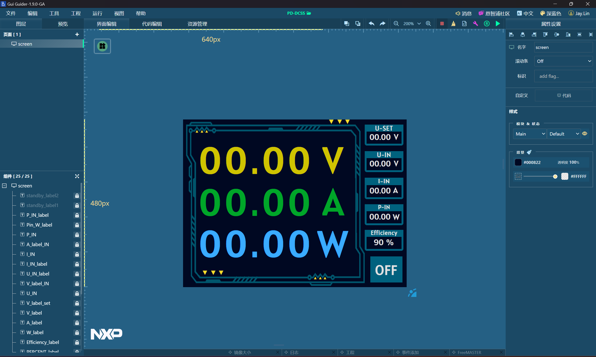
  <figcaption>图3-6-1 显示界面设计工程</figcaption>
</figure>

## 3.7 PCB绘制要点

### 3.7.1 导线宽度

考虑到负载两端的电压从2-15V变化，负载最低为5Ω，所以最大电流可能达到3A,甚至更高。
在 PCB 设计中，导线宽度需根据电流大小、铜箔厚度、温升等因素计算。根据 IPC - 2221 标准和经验公式，将导线的宽度设置为能承受3.5A电流的宽度。

#### 3.7.1.1  关键参数设定

- **铜箔厚度**：PCB 铜厚为**1oz（35μm）** 。
- **温升限制**：PCB 走线温升不超过 **10°C**（安全值）。
- **电流值**：3A（持续电流）。

#### 3.7.1.2  线宽计算

经查询国际官网，公式如下：
<figure style="text-align: center;">
  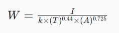
  <figcaption>IPC - 2221 标准公式</figcaption>
</figure>
W：线宽（英寸）
I：电流（A）
k：修正系数（内层走线取 0.024，外层取 0.048）
T：温升（°C）
I：铜箔厚度（oz）
代入PCB板的数据进行计算，最后将线宽最大设置到100mil，最先不小于50mil（考虑不同的支路）

### 3.7.2 散热要求

DCDC芯片对散热要求较高，需要进行大面积铺铜和大量的过孔来承受较大的电流；FB回路为敏感信号回路，需要远离SW引脚;SW引脚连接的电感可做屏蔽处理，减少对地平面的干扰。以下为两颗DCDC芯片的layout

#### 3.7.2.1 TPS5450DDARlayout

<figure style="text-align: center;">
  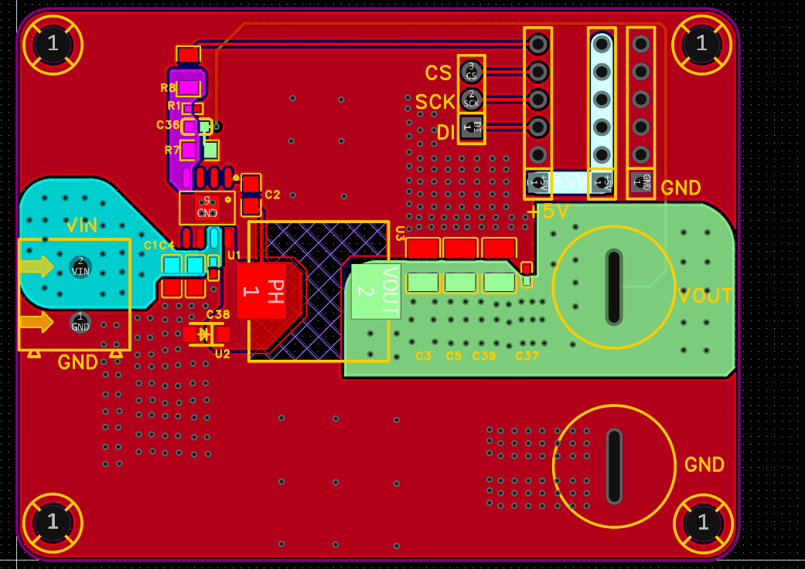
  <figcaption>图3-7-2-1 TPS5450DDAR布局图1</figcaption>
</figure>
<figure style="text-align: center;">
  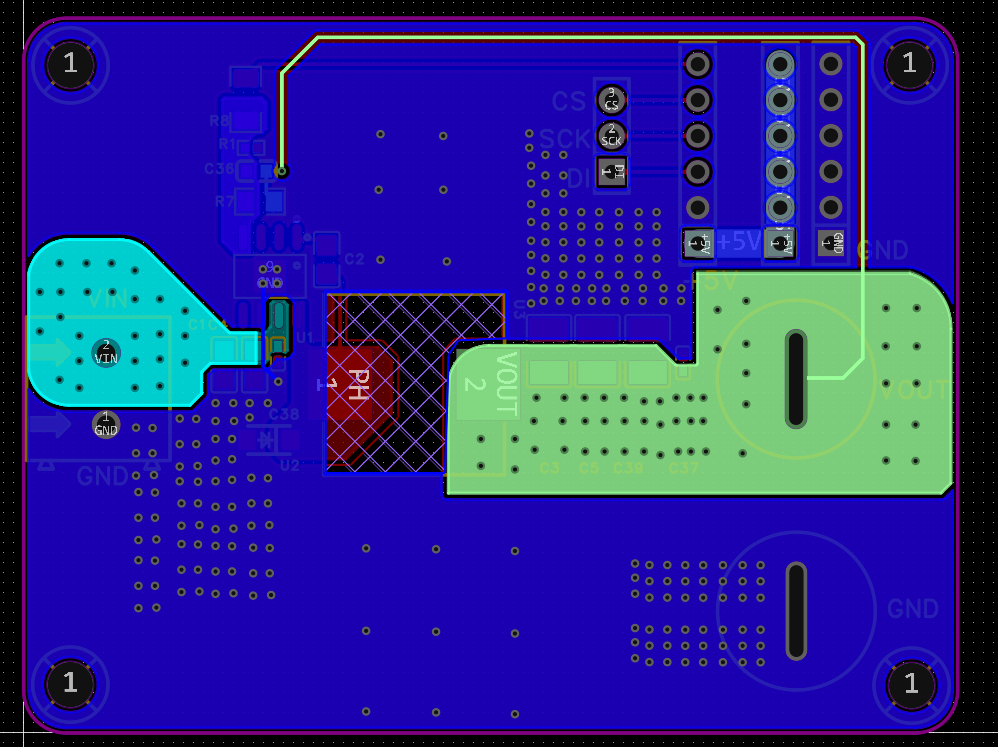
  <figcaption>图3-7-2-2 TPS5450DDAR布局图2</figcaption>
</figure>

#### 3.7.2.2 TPS62932DRLRlayout

<figure style="text-align: center;">
  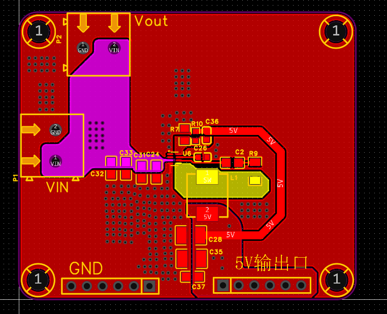
  <figcaption>图3-7-2-3 TPS62932DRLR布局图1</figcaption>
</figure>
<figure style="text-align: center;">
  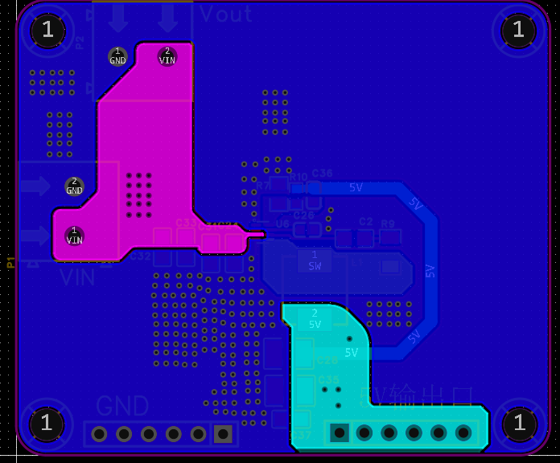
  <figcaption>图3-7-2-4 TPS62932DRLR布局图2</figcaption>
</figure>

## 3.8 3D外壳设计

在实际应用以及美观的目标下，我们设计了一个合适这个产片的3D外壳，大体外形如下：
<figure style="text-align: center;">
  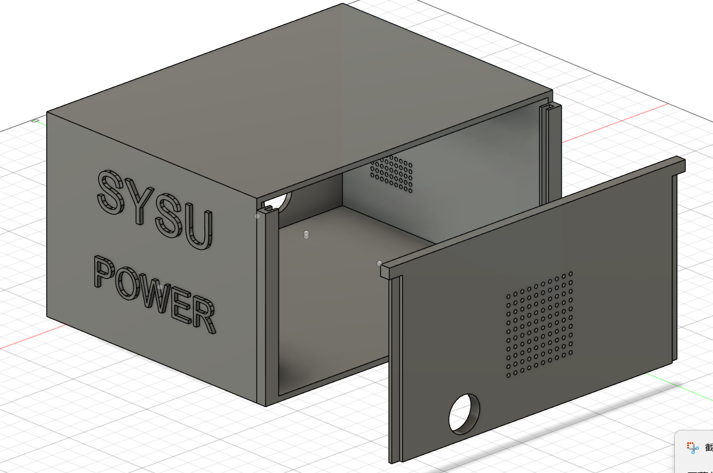
  <figcaption>图3-7-1  后侧方图</figcaption>
</figure>
<figure style="text-align: center;">
  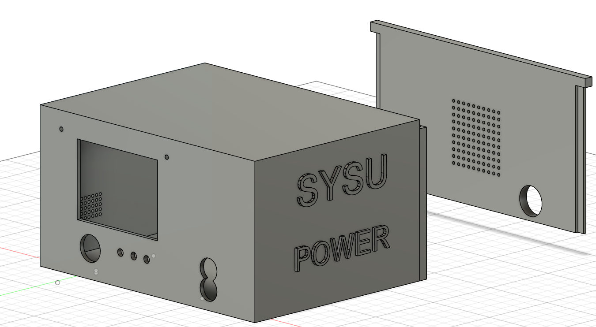
  <figcaption>图3-7-2  前侧方图</figcaption>
</figure>

外壳正前方的长方体空缺对应TFT屏幕，将呈现输出电流、输出电压、输出功率等基本内容。下方的圆孔分别对应旋转编码器以及控制板的三个按键。正面右方的空缺将契合负载模块上的香蕉插座，可以用香蕉插头转鳄鱼夹的连接线，修改所连负载阻值大小。

外壳的拼接采用单面凹槽设计，在背部的面板上设计凸出，在前部分整体上设计契合的凹槽，并留有3D打印最小输出孔径的余量，使背板正好可以拼合整个外壳。

侧面印有 “SYSU“”POWER” 字样，在另一侧面与背部均安设有散热孔，可以满足电源的散热要求，防止过热。

# 4 关键技术原理及创新点

## 4.1 程序设计中的创新点

### 4.3.1 FreeRTOS资源高效利用

相较于裸机开发方式多任务并行能力差、占用内存高等缺点，本项目创新性地对FreeRTOS提供的系统资源进行了全面而高效的利用：

#### 4.3.1.1 任务优先级精细划分

基于 FreeRTOS 的抢占式调度机制，根据任务的实时性需求与功能重要性构建优先级梯队。核心控制任务（编码器系列任务）被赋予最高优先级以确保响应及时性，数据采集任务次之，人机交互任务优先级最低。结合优先级继承机制避免低优先级任务持有互斥量时被高优先级任务无限阻塞，实现任务调度的确定性与资源分配的公平性。

#### 4.3.1.2 互斥量保护共享资源

针对多个任务并发访问外设寄存器、全局变量等共享资源时可能出现的竞态条件，采用 FreeRTOS 互斥量（Mutex）实现独占式访问控制。通过xSemaphoreCreateMutex()创建互斥量，在任务访问共享资源前调用xSemaphoreTake()获取所有权，访问完成后通过xSemaphoreGive()释放。互斥量内部集成优先级继承机制，当高优先级任务尝试获取被低优先级任务持有的互斥量时，会临时提升低优先级任务的优先级至与高优先级任务相同，避免优先级反转导致的死锁风险。

#### 4.3.1.3 事件组实现高效任务通信

为解决多任务间复杂事件的协同问题，采用 FreeRTOS 事件组（Event Group）替代传统信号量，实现多事件的逻辑组合通信。事件组基于位操作实现高效通信，避免信号量多次 P/V 操作的开销，适用于需要多条件触发的复杂场景。

#### 4.3.1.4 消息队列处理异步事件

针对传感器数据采集、人机交互命令等异步事件，设计基于 FreeRTOS 消息队列（Message Queue）的异步通信机制。通过创建队列，指定消息缓冲区大小与单个消息长度，任务可使用xQueueSend()向队列发送数据，使用xQueueReceive()阻塞等待消息。队列采用 FIFO（先进先出）原则管理消息，支持设置超时时间避免任务无限阻塞。例如，触摸屏中断服务程序将触摸坐标封装为消息发送至队列，UI 任务从队列中读取消息并更新界面，实现中断处理与业务逻辑的解耦，提升系统响应实时性。

### 4.3.2 LVGL库用于UI界面设计

相较于直接使用TFT库编写的简略粗糙的界面，本项目创新性地使用LVGL库构建了美观且功能丰富的用户界面：

#### 4.3.2.1 自定义主题和样式  

本界面利用LVGL库构建自定义主题，以深蓝色而不是纯黑色作为背景，使得UI底色更具有科技感而非单调。针对电参数采用差异化色彩编码：输出电压（黄色）、输出电流（绿色）、输出功率（蓝色），通过颜色直观区分参数类型；待机状态提示（红色“StandBy Mode...”）和电源状态（OFF为红色文字搭配蓝色背景框，ON状态（未显示时按设计逻辑为绿色））形成视觉对比，突出设备状态；输入参数（U-IN、I-IN、P-IN）及效率百分比（白色）在深蓝色背景上清晰可读。动态文本颜色调整（如根据参数确认状态变更颜色），既增强信息辨识度，又使界面在统一主题下呈现层次化视觉效果。数字显示区外边采用机械样式的花纹，营造出科技感与专业性兼具的交互氛围。

#### 4.3.2.2 多种显示元素组合  

界面整合多元显示元素，实现功能分区可视化。中央数字显示区以大字体、高对比度色彩（黄、绿、蓝）突出输出电压、电流、功率，确保核心参数一目了然；顶部待机提示（红色）和底部操作提示（“Wait For Key Press”），配合右侧电源状态（OFF）及效率（90%），实时反馈设备运行与交互状态；右侧设置区域按“U-SET（输出电压设定）→ U-IN（输入电压）→ I-IN（输入电流）→ P-IN（输入功率）”顺序排列，标签与数值一一对应，支持输出电压的调节与显示。各元素布局紧凑且逻辑清晰：数字显示区占据视觉中心，状态与设置区分列两侧，既保证信息全面性，又通过色彩、字体大小的差异，实现功能模块的自然划分，提升用户对界面信息的读取效率。

#### 4.3.2.3 交互响应机制  

基于LVGL库实现编码器与按钮的交互逻辑：用户通过编码器调节U-SET（输出电压设定），按钮确认后，界面实时更新数字显示区与设置区域的数值，确保参数调节的即时反馈（如调节时U-SET与输出电压同步变化）。设备状态（如待机、电源切换）随操作动态更新：待机时顶部红色提示、底部“Wait For Key Press”引导操作；电源ON/OFF状态通过颜色（OFF为白色背景框，ON为绿色，按设计逻辑）直观呈现，增强交互反馈。此外，界面在参数调节、状态变更时均进行实时刷新，确保用户操作与界面显示的一致性（如效率百分比、输入参数的动态更新）。通过“调节→确认→反馈”的闭环交互，结合编码器的精准调节与按钮的快捷确认，实现了操作的便捷性与界面反馈的即时性，提升了人机交互的流畅度与用户体验。

<figure style="text-align: center;">
  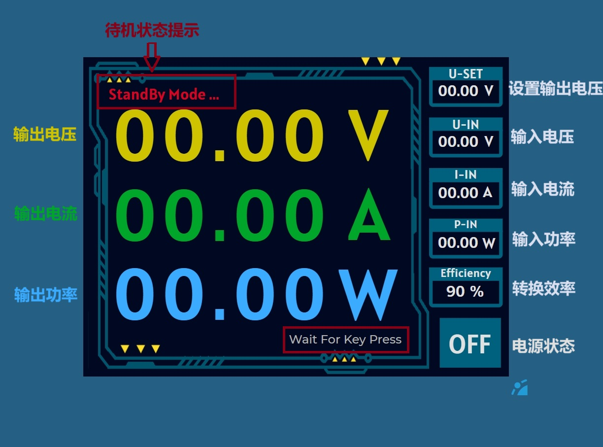
  <figcaption>图4-3-2 程控直流稳压电源UI界面</figcaption>
</figure>

# 5 测试结果

负载：5 ohm

| **输出DC 电压（V）** | 2   | 4   | 6   | 8   | 10  | 12  | 14  |
| :------------: | --- | --- | --- | --- | --- | --- | --- |
| **输出DC 电流（A）** |     |     |     |     |     |     |     |
|  **输出功率（W）**   |     |     |     |     |     |     |     |

负载：10 ohm

| **输出DC 电压（V）** | 2   | 4   | 6   | 8   | 10  | 12  | 14  |
| -------------- | --- | --- | --- | --- | --- | --- | --- |
| **输出DC 电流（A）** |     |     |     |     |     |     |     |
| **输出功率（W）**    |     |     |     |     |     |     |     |

# 6 团队队员分工介绍

三名队员均是来自中山大学电子与信息工程学院（微电子学院）的大一学生。

队长主要负责 DC - DC 模块设计；搭建供压模块的整体架构并确定参数，保障系统各部分稳定供电；利用三维建模软件设计契合电路需求与美观要求的 3D 外壳；提供PCB布局设计指导；对整个项目进行全面统筹规划，涵盖进度安排、任务分配、资源协调等，精准把控项目整体方向；负责方案的撰写。

队友 1 主要负责整流模块、输入输出电压电流检测模块和 3D 外壳设计和制作。运用专业知识设计整流电路，精心选用合适的整流元件，确保整流效果满足系统要求；设计输入输出检测模块，包括电流、电压检测等，选用合适的检测芯片与元件，实现对系统输入输出参数的精准监测。同时负责设计报告架构的撰写、变压器正常输出电压实操等。

队友 2 主要负责嵌入式开发、接口通信、显示驱动及控制模块方面，主要负责软件程序的设计与调试，完成单片机的调试工作，实现程控直流稳压电源的程控系统实现；合理规划系统各部分之间的接口，确保数据传输稳定高效；负责 TFT 显示屏的UI界面设计，让信息得以清晰显示。同时也负责报告内容的撰写。

# 7 总结与展望

我们的作品基本完成了预期实现目标，实现了输入电压AC 18V，输出电压DC 2-15V，输出精度0.1V，纹波电压不大于15mV，电源效率可达90%以上的程控直流稳压电源设计指标，同时具有便于操作、界面美观等优点。但我们深知我们的作品仍有巨大的改进空间，以下是我们希望在未来继续改进的地方：

- 设计更加美观的3D外壳，并安装完善
- 发挥该款ESP32-S3开发板的WIFI或蓝牙模块功能，实现远程操控电源
- 设计更多保护功能和报警功能，当运行出现异常的时候可以发送远程警报。
- 增强电源的散热能力

这次比赛对我们三个大一新人来说是一个巨大的挑战，在实现项目的过程中遇到了不少挫折。但我们坚信，勇敢面对这样的挑战，相较于同龄人我们能更早获得更多的工程经验，以及在实践中不断深入我们对电路设计，嵌入式开发相关知识的理解。

# 8 项目网址

为了更好地学习和接受批评建议，我们已经将项目各个部分开源到了github和嘉立创平台。
[github项目开源链接](https://github.com/silence-breaker/Electronic-Design-Program)
[嘉立创PCB项目开源链接](https://oshwhub.com/jingxuancheng/national-electric-race)
[队长的个人博客](https://www.wj-blog.top/)
