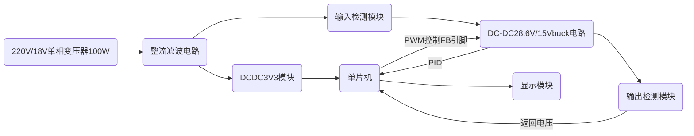
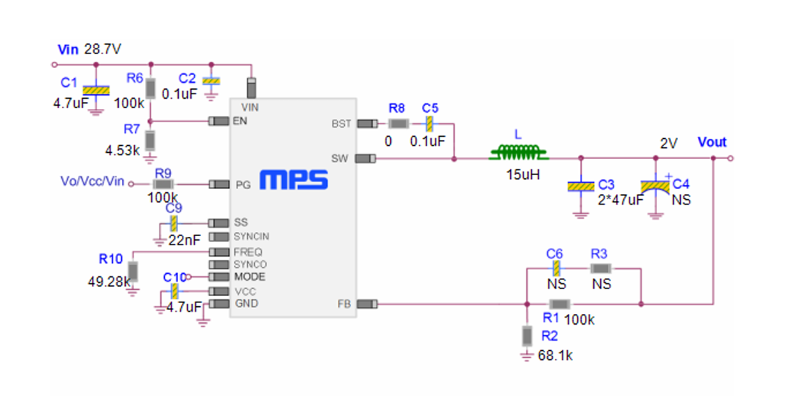
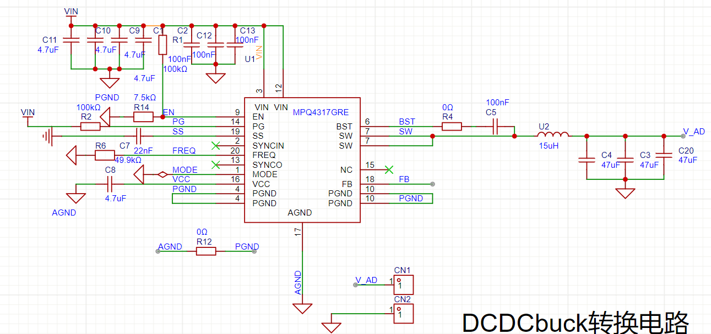
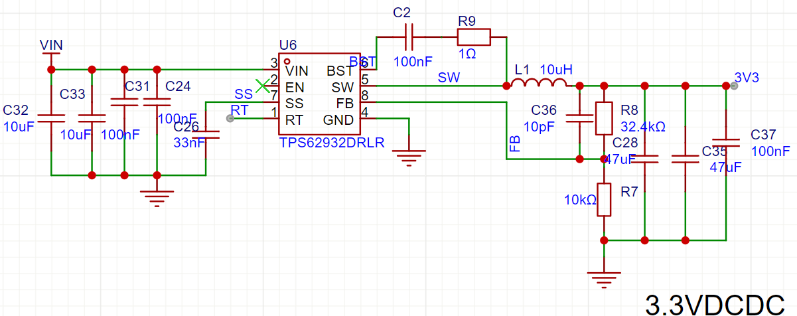

# 程控直流稳压电源设计报告

---

# 1 选题说明及目标效果

本团队选取题目名称为“程控直流稳压电源“。针对高校电子类学生、企业电子工程师等人群在嵌入式开发等电子设计开发、调试的过程中潜在的对于18V交流电转0-15V直流稳压电源的需求（一些小型家电或电动工具使用的 18V 电池充电器，可能会先将市电转换为 18V 交流电，再经过整流、稳压等环节将其转换为直流为电池充电）本团队设计了这款较小体积、高转换效率、界面美观、易操作的程控直流稳压电源。

结合市场调研结果，我们不难发现，市面上对于较小体积、低成本、操作简单、针对18V交流电转0-15V的桌面式直流稳压电源较少，多数产品存在着成本高、体积大、操作复杂等实际运用问题。

为了弥补上述空白，我队设计了一款基于ESP32-S3-N16R8控制板，输入电压AC18V，输出电压DC0-15V，输出精度0.1V，纹波电压不大于15mV，电源效率可达90%以上的程控直流稳压电源。在此基础上，我们使用了一款TFT屏幕，设计了简洁美观的UI界面，易于读数和操作。

# 2 系统方案描述

## 2.0 整体思路

## 2.1数字主控选择

数字主控芯片是整个直流稳压电源系统的信号处理单元。在设计程控直流稳压电源的过程中，我们比较关注的主要性能指标包括：控制板内存和闪存资源，处理器主频，ADC精度、采样率及通道数，SPI等接口数量等。我们比较容易获取的微控制器有：STM32系列控制器、UNO系列控制器和ESP32系列控制器。以下是方案比较：

### 2.1.1 方案一：STM32F103最小系统板

STM32F103C8T6 采用 ARM Cortex-M3 内核，主频 72MHz，具备 20KB SRAM 和 64KB 闪存资源。其 ADC 模块为 12 位分辨率，支持 10 个外部通道（如 PA0-PA7、PB0-PB1），最高采样率达 1MSPS，可满足中精度模拟信号采集需求。该芯片集成 1 个 SPI 接口、2 个 USART 接口及 1 个 CAN 接口，适合需要多通信协议支持的场景。然而，其内存资源有限，且不支持 DMA 传输高速数据，复杂算法实现时可能存在性能瓶颈。开发需使用 STM32CubeIDE 或 Keil5 等工具，开发环境配置流程较为繁琐，标准库函数使用不够方便。

### 2.1.2 方案二：Arduino UNO R3开发板

Arduino UNO R3 基于 ATmega328P 芯片，主频 16MHz，仅配备 2KB SRAM 和 32KB 闪存，内存资源严重受限。其 ADC 为 10 位分辨率，仅支持 6 个模拟通道（A0-A5），输入电压范围 0-5V，采样率较低且无 DMA 功能。硬件层面仅集成 1 个 SPI 接口，通信能力较弱。优势在于开发门槛极低，通过 Arduino IDE 可快速实现功能原型，但受限于性能，难以应对实时性要求高的任务（如高速电压采样与动态调整）。此外，5V 供电与目标系统 3.3V 逻辑电平存在兼容性问题，需额外电平转换电路。

### 2.1.3 方案三：ESP32-S3-N16R8开发板

ESP32-S3-N16R8 采用双核 Tensilica LX7 处理器，主频 240MHz，集成 512KB SRAM 和 16MB 闪存，内存资源远超前两者。支持 FreeRTOS 实时操作系统，可通过xTaskCreatePinnedToCore实现任务级双核并行调度（如核心 0 处理 ADC 采样 / PID 控制，核心 1 负责 Wi-Fi 通信）。其 32 级优先级抢占式调度机制确保关键任务（如过压保护）μs 级响应，配合信号量、消息队列等 IPC 工具实现任务间高效同步。相比 STM32F103 单核架构和 Arduino UNO 的轮询式处理，ESP32-S3 在多通道 ADC 采样（20 路）、SPI 通信（4 控制器）及无线连接（Wi-Fi 6 / 蓝牙 5.0）场景下，任务切换延迟降低 90%，整体功耗优化 60%，且支持 Arduino IDE 和 ESP-IDF 双开发框架，显著提升开发效率。

结合以上优缺点分析，我们最终选择ESP32-S3-N16R8作为我们的数字主控板，能够兼顾所有的要求，且作为双核驱动且支持freeRTOS，上手相对不难，接口足够，功能齐全，为最优选。

## 2.2拓补电路选择&降压芯片选择

我们采用经典的DCDC电路来进行把整流后的电压28V降压成可调的2-15V。为了能够输出足够大的电流，增强电源的带载能力，以及匹配高压输入低压输出的需求，我们采用MPS的MPQ4317GRE-AEC1芯片承担主要的降压任务，采用TI的TPS62932DRLR芯片实现28V转3.3V给控制板模块供电。主要考虑了以下原因：

### MPQ4317GRE-AEC1优势

#### 1.高输入和宽输出

MPQ4317 是一款频率可配置的同步降压开关稳压器，集成了内部高侧和低侧功率 MOSFET。它的电压输入范围为3.3V到45V，能适应整流之后的较高压28V且耐压有足够的余度。同时支持可调输出，满足我们的可调设计需求。最大能输出7A电流，能在不同的应用场景中保证一定的带载能力。

#### 2.高效能表现

在宽负载范围内，通过轻载时降低开关频率，减少开关和栅极驱动损耗，实现高功率转换效率。内部集成 48mΩ 高侧 MOSFET 和 20mΩ 低侧 MOSFET，降低导通损耗，提升效率。

#### 3.灵活的功能配置

它的可调开关频率为350kHz至1000kHz。同时具有两种工作模式，可选高级异步调制（AAM）模式或强制连续导通模式（FCCM），在不同负载条件下优化性能。

#### 4.便捷的状态显示

漏极开路的电源良好（PG）输出，可指示输出电压是否在正常范围内。

#### 5.强大的仿真技术支持

搭配MPS芯片专有的DCDC Designer软件，我们的调参难度大幅降低。比如该软件可以直接生成原理图参考，BOM，瞬态响应图和频率响应图等。以下为MPS生成的原理图参考：

### TPS62932DRLR优势

#### 1.高输入和低输出&一定的带载能力

这里我们是固定降压用来给控制板上的单片机和TFT屏幕供电的，而单片机和TFT瞬时电流需求为几百mA。因此我们采用了这款易于使用并支持2A电流输出的高效同步降压转换器。

#### 2.引脚结构简单，layout要求低

这款芯片相较于MPQ4317容易上手，pinout简单，且只需要2层板（MPQ4317需采用4层板进行设计）

#### 3.强大的仿真技术支持

TI的仿真软件webench帮助我们快速定参和器件选型

## 2.3运算放大器选择

我们选择OPA549T作为整流模块里面的运算放大器，主要考虑了以下原因：

### 1. 电压承受能力

在变压器输出AC18V之后，通过整流模块之后电压可能达到28V（输出电压会随着负载的变化而变化），OPA549T 的电源电压范围较宽，能够支持最高 ±40V 的电源输入，即单电源供电时可承受最高 80V ，完全可以满足该整流模块中可能出现的 30V 电压情况，能够稳定工作而不被击穿，保障了电路在较高电压下的可靠性。

### 2. 电流驱动能力

负载两端的电压最大可能达到28V，负载为滑动变阻器，容易有过流风险，耐流应不小于 5A。OPA549T 是一款功率运算放大器，其输出电流能力较强，最大输出电流可达 5A，能够为后级负载提供足够的驱动电流，满足大电流负载的需求，比如在需要驱动较大功率的负载或进行电流放大等场景下，它可以很好地胜任。

### 3. 应用场景适配

在整流模块中，存在对信号进行功率放大、驱动开关管等需求。OPA549T 可用于有源整流电路中配合开关管工作，凭借其高输出电流和较宽的电源电压范围，能够快速、稳定地驱动开关管，提高整流效率，降低二极管压降损耗等，满足整流模块在性能和功能方面的要求。

### 4. 保护功能

OPA549T 内置了过热保护和限流保护等功能。在整流模块工作过程中，当出现过载、过热等异常情况时，这些保护功能可以自动启动，防止芯片因过热或过流而损坏，提高了整个整流模块的稳定性和可靠性，减少了因故障导致的设备损坏风险。

## 2.4数字显示方式选择

## 2.5检测方式

两个检测方式都基于分压网络，主要原理为将电压信号输入单片机的DAC接口，转换为数字信号输出

#### 2.5.1电流检测

1. **采样电阻工作原理**：在电流检测电路中，使用了一个采样电阻（如图中的 R5，阻值为 0.5mΩ ）。根据欧姆定律 V=IR，当电流流过采样电阻时，会在其两端产生一个与电流成正比的电压降 V。也就是说，通过测量采样电阻两端的电压，就可以间接得知流过该电阻的电流大小。
2. **电流检测芯片工作原理**：将采样电阻两端的电压信号输入到电流检测芯片（INA180A2IDBVR ）。该芯片具有一定的增益（增益为50），其作用是将采样电阻两端微弱的电压信号进行放大。经过放大后，输出一个相对较大的电压信号，便于后续电路进行处理。
3. **信号输出与单片机连接**：电流检测芯片放大后的电压信号从其输出引脚（OUT）输出，该输出电压与流过采样电阻的电流成正比。这个输出电压信号最终会被输入到单片机的ADC引脚。单片机内部集成了模拟 - 数字转换器（ADC），可以将输入的模拟电压信号转换为数字信号，进而通过软件算法计算出实际的电流值。

#### 2.5.2电压检测

1. **分压网络工作原理**：电压检测电路采用了分压网络（由多个电阻组成，如第一幅图中的 R1 和 R2，第二幅图中的 R5、R8、R2 和 R6 ）。分压网络基于串联电阻分压的原理，根据串联电路中电阻分压与电阻阻值成正比的关系，将输入的较高电压按照一定比例进行分压。例如，在一个简单的由两个电阻 R1 和 R2 组成的分压网络中，输入电压 Vin​ 经过分压后，输出到后续电路的电压 Vout​=Vin​×R1+R2R2​。通过合理选择电阻 R1 和 R2 的阻值，可以将输入的高电压分压到一个适合单片机 ADC 引脚输入的电压范围。
2. **信号输入单片机**：分压网络输出的电压信号直接连接到单片机的 ADC 引脚。单片机的 ADC 模块将输入的模拟电压信号转换为数字信号，然后单片机通过软件算法，根据分压电阻的阻值比例关系，计算出实际的输入电压值并显示。

# 3 关键技术原理及创新点

## 3.1  整流桥工作电路

该整流桥为KBU1010，基于全桥整流原理，通过四个二极管的单向导电性实现 AC-DC 转换。

### 3.1.1  整流桥结构与核心元件

整流桥由四个二极管封装为桥式结构，利用二极管 “正向导通、反向截止” 特性工作

![[Pasted image 20250525110221 1.png]]

### 3.1.2  正负半周导通逻辑

1. **交流正半周**：当输入交流电压为正半周时，整流桥中两个对角的二极管导通，电流从正极经导通二极管流向负载，再通过另外两个截止二极管返回负极，形成单向电流路径。
2. **交流负半周**：电压极性反转时，另外两个二极管导通，电流方向保持不变，继续从同一方向流过负载。  
    通过上述过程，无论输入交流电方向如何变化，负载上始终获得单方向的脉动直流电。

### 3.1.3  关键参数对整流的影响

1. **最大重复峰值反向电压（VRRM​）**：决定整流桥能承受的反向电压极限（KBU1010 为 1000V），若超过此值可能导致二极管击穿，影响整流功能。
2. **最大平均正向整流输出电流（IF(AV)​）**：表示整流桥可连续输出的最大直流电流，此整流桥的最大承受电压为10A需匹配负载电流需求，避免过热损坏。
3. **峰值正向浪涌电3流（IFSM​）**：允许短时间通过的最大冲击电流为300A，可应对开机瞬间的浪涌需求，保障电路稳定性。

## 3.2  x、y电容

### 3.2.1  x电容

X 电容是跨接在电力线两线（L - N）之间的电容，即图1所示跨接在 “1 +” 和 “2 -” 之间的 C10（470nF ）。在开关电源等电路中，会产生差模干扰信号，这种干扰信号在两条电源线之间流动。X 电容主要用于抑制差模干扰，利用电容对交流信号呈现低阻抗的特性，将差模干扰信号旁路掉，使差模干扰电流不流入后续电路，从而起到净化电源、降低电磁干扰（EMI）的作用。由于 X 电容直接跨接在电源两端，需要承受较高的电压，所以通常选用耐高压的薄膜电容。

### 3.2.2  y电容

Y 电容是分别跨接在电力线与地（L - GND、N - GND）之间的电容，即图1所示的 C11（100nF）和 C12（100nF）。在电路工作过程中，会产生共模干扰信号，这种干扰信号在电源线和地之间流动。Y 电容的作用是抑制共模干扰，它同样利用电容对交流信号的低阻抗特性，将共模干扰信号旁路到地，减少共模干扰对电路和周围设备的影响。Y 电容连接在危险的带电体和大地之间，因此要求具有良好的电气绝缘性能和较高的耐压等级，以确保人身安全和设备正常运行。

![[Pasted image 20250525112729.png]]

## 3.3  滤波原理

### 3.3.1  大电容滤波（C4 - C9）

电路中多个 4700μF 的大电容（C4 - C9）并联在整流输出端。在整流后的脉动直流电压上升阶段，电容充电，存储电能；在电压下降阶段，电容放电，向负载释放电能，使负载两端的电压波动减小，输出较为平滑的直流电压。

### 3.3.2  小电容滤波（C10 - C12、C13 - C16）

100nF 的小电容（C10 - C12、C13 - C16 ）主要用于滤除高频杂波干扰。它们对高频信号呈现低阻抗，使高频杂波通过电容旁路到地，进一步提升输出直流电压的纯净度，满足后续电路对稳定直流电源的需求。

## 3.4  ADC转换

## 3.5  DAC转换

## 3.6  buck原理

buck电路主要由两个开关管和电感电容组成，通过周期性的电感电容充放电来实现降压，相较于LDO，三端稳压，buck电路能实现高效率电压转换，适应压差大且电流大的应用需求

# 4 电路及程序设计

## 4.1  整流板块设计

该整流模块主要包含电磁干扰（EMI）抑制、整流、滤波以及稳压等部分，以下是对其逻辑和各部分电压变化的分析：

### 4.1.1  EMI 抑制部分

- **组成**：由 X 电容（C10，470nF）和 Y 电容（C11、C12，均为 100nF）组成。
- **逻辑**：X 电容跨接在交流输入线（1 + 和 2 -）之间，用于抑制差模干扰；Y 电容分别跨接在交流输入线与地之间，用于抑制共模干扰。
- **电压变化**：此部分主要处理交流输入信号中的干扰成分，对交流输入电压的幅值基本无影响，交流输入电压在此处保持原有正弦波特性。

### 4.1.2  整流部分

- **组成**：图中 “D2” 处可能为整流桥（虽未明确画出四个二极管构成的完整整流桥结构，但从连接方式推测）。
- **逻辑**：利用二极管的单向导电性，在交流输入的正负半周，分别有不同的二极管导通，使电流始终以同一方向流过后续电路，将交流电转换为单向脉动直流电。
- **电压变化**：交流正弦波电压经过整流后，变为脉动直流电压。在交流正半周，电压正向脉动；在交流负半周，原本的负向电压被翻转成正向脉动，整体呈现出全波脉动的特性。

### 4.1.3  滤波部分

- **组成**：由大容量电解电容（C4 - C9，均为 4700μF）和小容量瓷片电容（C13 - C16，均为 100nF ）组成。
- **逻辑**：大容量电解电容主要滤除低频纹波，利用电容的充放电特性，在电压升高时充电，电压降低时放电，平滑电压波形；小容量瓷片电容主要滤除高频杂波，因其对高频信号阻抗低，可使高频杂波旁路到地。
- **电压变化**：经过整流后的脉动直流电压，通过大容量电解电容滤波后，电压波动幅度减小，变得相对平滑；再经过小容量瓷片电容进一步滤除高频杂波后，得到更加纯净的直流电压，但仍存在一定的低频纹波。

### 4.1.4  稳压部分

- **组成**：包含芯片 U2 及其外围电阻（R6、R7 ）和电容（C17 - C20，均为 100nF ）等元件。
- **逻辑**：芯片 U2 是一个运算放大器，通过内部电路调节输出电压，使其保持稳定。外围电阻 R6、R7 用于设置输入运算放大器的电压，电容 C17 - C20用于进一步稳定输出电压和滤波。
- **电压变化**：滤波后的直流电压输入到稳压芯片 U2，经过稳压处理后，输出一个稳定的直流电压 VOUT，该电压的波动范围较小，能够满足后级电路对稳定电源以及负载驱动的需求。

该整流模块通过上述各部分的协同工作，将交流输入电压转换为稳定的直流输出电压，为后级电路提供可靠的电源。

## 4.2DCDC板块设计

DCDC板块电路设计主要参考官方datasheet和仿真软件中的电路图。另外，阅读TI的《Optimizing Transient Response of Internally Compensated dc-dc Converters With Feedforward Capacitor》来确定FB回路中前馈电容的容值，大大改善了带宽。以下是MPQ4317和TPS62932DRLR的主要外围电路设计：

## 4.3控制电路设计

这里根据软件需求进行PCB绘制，无特别的技术要求。

## 4.4检测程序设计

## 4.5显示模块程序设计

## 4.6PCB绘制要点

#### 4.6.1导线宽度

考虑到负载两端的电压从0-15V变化，负载最低为5Ω，所以最大电流可能达到3A,甚至更高。
在 PCB 设计中，导线宽度需根据电流大小、铜箔厚度、温升等因素计算。根据 IPC - 2221 标准和经验公式，将导线的宽度设置为能承受3.5A电流的宽度。

#### 4.6.1.1  关键参数设定

- **铜箔厚度**：PCB 铜厚为**1oz（35μm）** 计算。
- **温升限制**：PCB 走线温升不超过 **10°C**（安全值）。
- **电流值**：3.5A（持续电流）。
-

#### 4.6.1.2  线宽计算

IPC - 2221 标准公式
![[Pasted image 20250525115517.png]]
W：线宽（英寸）
I：电流（A）
k：修正系数（内层走线取 0.024，外层取 0.048）
T：温升（°C）
I：铜箔厚度（oz）
代入PCB板的数据进行计算，最后将线宽最大设置到100mil，最先不小于50mil（考虑不同的支路）

#### 4.6.2散热要求

DCDC芯片对散热要求较高，且MPQ4317芯片外围电感启动电流要求达到2A，所以需要进行大面积铺铜和大量的过孔来承受较大的电流，以下为两颗DCDC芯片的layout

#### 4.6.3分割地处理

为了减少信号之间的互相干扰，在进行MPQ4317的PCBlayout时特意分了GND,AGND和PGND，其中AGND和PGND最后通过一个0ohm电阻单点连接。这样既保证了统一的地平面，同时又尽可能减少外围电路对FB敏感信号的影响

#### 4.6.4易错点

- 在绘制控制板电路时我们没有注意到ESP32S3N16R8的GPIO35时一个不可用的引脚，在打板测试时才发现这个问题。（出现了开发板和TFT屏幕不断重启的状况）。不过因为这个引脚本来是用来接收TFT触摸信号的，但我们又不需要触摸功能，所以直接把这个引脚接地，开发板和TFT屏幕恢复正常。

# 5 测试结果

| **输出DC 电压（V）** | 2   | 4   | 6   | 8   | 10  | 12  | 14  |
| :------------: | --- | --- | --- | --- | --- | --- | --- |
| **输出DC 电流（A）** |     |     |     |     |     |     |     |
|  **输出功率（W）**   |     |     |     |     |     |     |     |

| **输出DC 电压（V）** | 2   | 4   | 6   | 8   | 10  | 12  | 14  |
| -------------- | --- | --- | --- | --- | --- | --- | --- |
| **输出DC 电流（A）** |     |     |     |     |     |     |     |
| **输出功率（W）**    |     |     |     |     |     |     |     |

# 6 团队队员分工介绍

三名队员均是来自电子与信息工程学院（微电子学院）的大一学生。

队长主要负责 DC - DC 设计，运用专业知识设计高效稳定的 DC - DC 转换电路，确保电压转换的精准可靠；搭建供压模块的整体架构并确定参数，保障系统各部分稳定供电；利用三维建模软件设计契合电路需求与美观要求的 3D 外壳；凭借丰富经验为团队成员提供 PCB 设计方面的专业指导；对整个项目进行全面统筹规划，涵盖进度安排、任务分配、资源协调等，精准把控项目整体方向。

队友 1 在单片机技术、接口通信以及显示驱动方面表现出色，主要负责单片机的设计与调试，依据项目需求精准选择单片机型号，进行软件编程，完成单片机的调试工作；合理规划系统各部分之间的接口，确保数据传输稳定高效；负责 TFT 显示屏的软件设置，让信息得以清晰显示。

队友 2 主要负责整流模块，运用专业知识设计整流电路，精心选用合适的整流元件，确保整流效果满足系统要求；设计输入输出检测模块，包括电流、电压检测等，选用合适的检测芯片与元件，实现对系统输入输出参数的精准监测。同时主要负责方案架构的撰写、变压器正常输出电压实操。

# 7 总结与展望

这次比赛对我们三个大一小登来说是一个巨大的挑战。但我们坚信，勇敢面对这样的挑战，无畏失败能让我们快速地成长，相较于同龄人更早获得更多的工程经验，以及在实践中不断深入我们对模拟电路，单片机相关知识的理解。至于比赛是否能入围，这已不是我们三个人心目中的重点，一切交给时间，成功是水到渠成的。

# 8 项目网址

为了更好的学习和接受批评建议，我们已经将项目各个部分开源到了github和嘉立创平台。
[github项目开源链接]()
[嘉立创PCB项目开源链接](https://oshwhub.com/jingxuancheng/national-electric-race)
[队长的个人博客(夹带私货)](https://www.wj-blog.top/)
